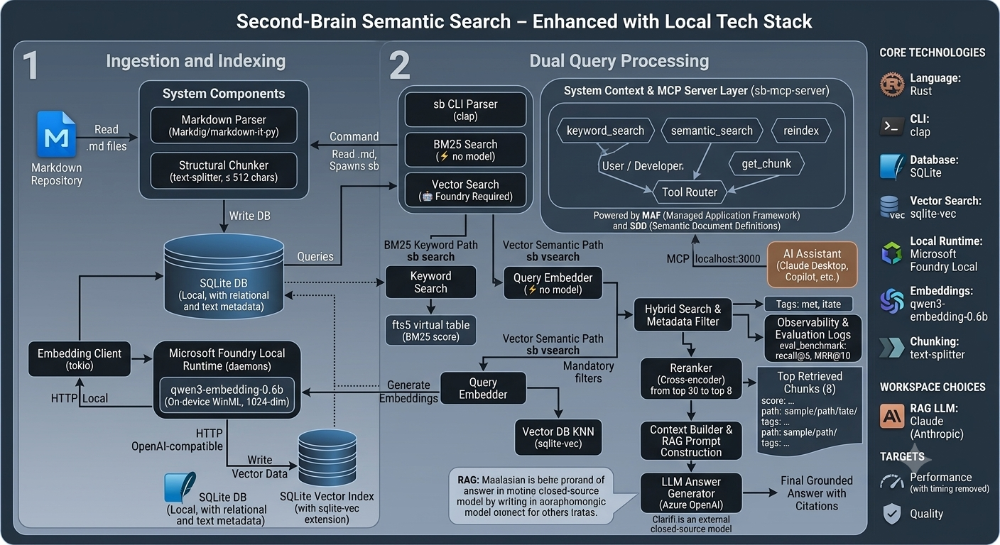

# second-brain-cli

A Rust CLI for indexing markdown notes with local vector embeddings and exposing them to AI assistants via MCP (Model Context Protocol).



Two binaries:

| Crate                    | Binary          | Role                                                       |
| ------------------------ | --------------- | ---------------------------------------------------------- |
| `sb`                     | `sb`            | CLI — manage collections, index markdown, search           |
| `sb-mcp-local-webserver` | `sb-mcp-server` | HTTP + MCP adapter — proxies search requests to `sb`       |

## How it works

`sb` walks a directory of markdown files, parses YAML front matter, cleans and chunks the text, and generates vector embeddings using [Microsoft Foundry Local](https://learn.microsoft.com/azure/foundry-local/) with the `qwen3-embedding-0.6b` model. Everything is stored in a single SQLite database at `~/.sb/sb.db`.

`sb-mcp-server` wraps `sb` as an HTTP service with both a plain REST API and a native [MCP](https://modelcontextprotocol.io/) endpoint, making your notes accessible to any AI assistant that supports MCP tool calls.

See [docs/architecture.md](docs/architecture.md) for technology choices, component diagrams, database schema, and the full text processing pipeline.

## Prerequisites

- [Rust](https://rustup.rs/) 1.80+
- [Foundry Local](https://learn.microsoft.com/azure/foundry-local/) installed and on `PATH`

> [!NOTE]
> On first use, `sb index` will automatically download the `qwen3-embedding-0.6b` embedding model via Foundry Local.

## Build

The Rust workspace lives under `src/`:

```sh
cd src && cargo build --release
```

Binaries are placed in `src/target/release/sb` and `src/target/release/sb-mcp-server`.

## Quick start

See [docs/quickstart.md](docs/quickstart.md) for a step-by-step walkthrough.

## `sb` — CLI reference

See [docs/quickstart.md](docs/quickstart.md) for a full walkthrough of collection management, indexing, and search.

The database defaults to `~/.sb/sb.db`. Override with `--db <path>` or the `SB_DB` environment variable. Run `sb --help` or `sb <subcommand> --help` for the full option reference.

## `sb-mcp-server`

See [docs/configuration.md](docs/configuration.md) for server setup, environment variables, and MCP client configuration.

## Project layout

```text
second-brain-cli/
├── docs/           # architecture, guides
├── images/         # diagrams and screenshots
├── src/            # Rust workspace (sb + sb-mcp-local-webserver)
├── dataset/        # sample data
└── tests/          # integration tests
```

## Docs

| File | Description |
| ---- | ----------- |
| [docs/quickstart.md](docs/quickstart.md) | Step-by-step setup and first-use guide |
| [docs/configuration.md](docs/configuration.md) | Environment variables and MCP server setup |
| [docs/architecture.md](docs/architecture.md) | System design, technology choices, database schema, pipeline diagrams |
