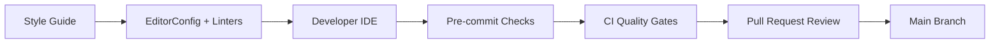

# 🎯 Implementing and Enforcing Code Standards - L3

## Question
>
> **Core Question:** In what ways can you implement and enforce Code Standards?
> **Follow-up:** What tools and processes ensure consistent code quality across a development team?

## 💡 Quick Answer (30 seconds)

- Use a **single source of truth** for rules (`.editorconfig`, lint rules, style guide).
- Enforce automatically in **IDE + CI + pull requests**.
- Keep feedback fast (local) and strict at merge time (CI quality gates).

## 📖 Simple Explanation

### Enforcement Layers

| Layer       | Goal                   | Typical Controls                              |
| ----------- | ---------------------- | --------------------------------------------- |
| Local IDE   | Prevent issues early   | Format on save, lint hints, code actions      |
| Pre-commit  | Block obvious mistakes | Lint, tests, formatting checks                |
| CI pipeline | Enforce team baseline  | Build, test, static analysis, quality gates   |
| PR review   | Human judgment         | Architecture, readability, naming, edge cases |

### Minimal Governance Model

### Tooling Checklist (Small Team)

| Area            | Must Have                    | Why                         |
| --------------- | ---------------------------- | --------------------------- |
| Formatting      | Auto-formatter               | Removes style debates       |
| Static analysis | Linter/analyzers             | Finds defects early         |
| Tests in CI     | Unit test run                | Protects behavior           |
| PR template     | Checklist                    | Makes reviews consistent    |
| Quality gate    | Thresholds (coverage/issues) | Prevents quality regression |

### Practical Adoption Strategy

1. Start with non-controversial rules (formatting, unused imports, obvious bugs).
2. Turn warnings into errors gradually.
3. Track a small set of metrics: build pass rate, lint violations, escaped defects.
4. Revisit rules quarterly to avoid "tool fatigue."

## ✅ Interview-Ready Summary

- Code standards work when they are **automated**, **visible**, and **enforced consistently**.
- The strongest model is layered: local checks + CI gates + human review.
- Keep standards practical and evolve them with team maturity.

## 📊 Confidence Level

- [ ] 🔴 Need to study (0-3)
- [ ] 🟡 Somewhat confident (4-6)
- [ ] 🟢 Very confident (7-10)
