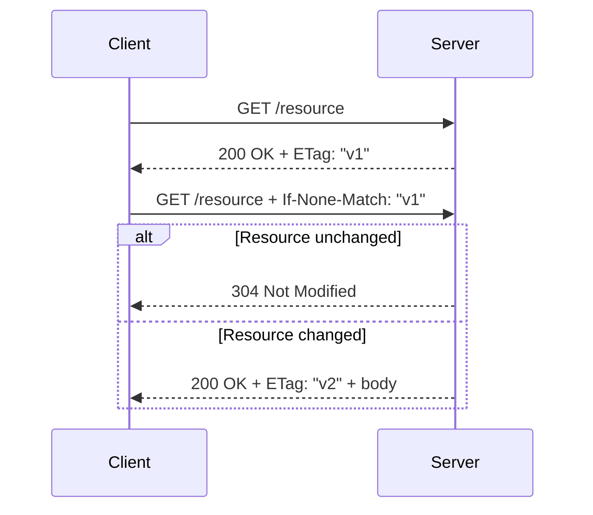

# 🎯 ETag Implementation and Usage - L3

## Question
>
> **Core Question:** What is an ETag and how does it work?
> **Follow-up:** How do you generate ETags for static files and dynamic content? What are the performance benefits?

## 💡 Quick Answer (30 seconds)

- **ETag** is a version identifier for a resource representation.
- Client stores it and sends it back via `If-None-Match`.
- If unchanged, server returns `304 Not Modified` with no response body.
- This reduces bandwidth and improves perceived performance.

## 📖 Simple Explanation

### What ETag Solves

| Problem                       | Without ETag            | With ETag            |
| ----------------------------- | ----------------------- | -------------------- |
| Re-downloading unchanged data | Full payload every time | `304` + headers only |
| Bandwidth usage               | Higher                  | Lower                |
| API latency (perceived)       | Slower repeat loads     | Faster repeat loads  |

### Request Flow

### Strong vs Weak ETag

| Type   | Format       | Meaning                   | Typical Use                               |
| ------ | ------------ | ------------------------- | ----------------------------------------- |
| Strong | `"abc123"`   | Byte-for-byte match       | APIs returning strict JSON/file versions  |
| Weak   | `W/"abc123"` | Semantically same content | Content where minor formatting can differ |

### Generation Strategies

| Resource Type       | Simple Strategy          | Notes                                 |
| ------------------- | ------------------------ | ------------------------------------- |
| Static file         | hash(file bytes)         | Most accurate, slightly more CPU      |
| Static file (fast)  | size + last-write-time   | Fast and usually enough               |
| Dynamic entity      | version/timestamp column | Great when DB already tracks versions |
| Collection endpoint | max(updated_at) + count  | Good for list invalidation            |

### Minimal Practical Rules

1. Use ETags mainly on `GET` endpoints.
2. Return `ETag` on successful `200` responses.
3. If `If-None-Match` matches current ETag, return `304`.
4. For updates (`PUT`/`PATCH`), consider `If-Match` to prevent lost updates (`412` on mismatch).

## ✅ Interview-Ready Summary

- ETag enables conditional requests and cache validation.
- It is most valuable for frequently-read, infrequently-changed resources.
- Combine with proper `Cache-Control` for best real-world effect.

## 📊 Confidence Level

- [ ] 🔴 Need to study (0-3)
- [ ] 🟡 Somewhat confident (4-6)
- [ ] 🟢 Very confident (7-10)
