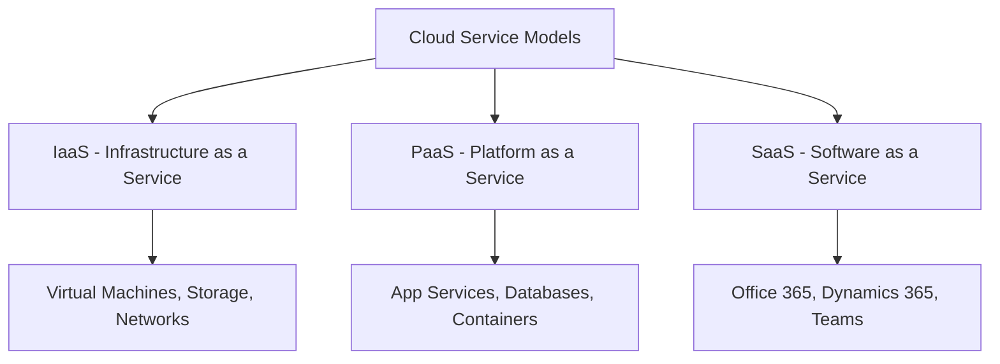

# 🎯 Azure PaaS vs IaaS vs SaaS - L2

## Question
>
> **Core Question:** Explain the differences between PaaS, IaaS, and SaaS in Azure. When would you choose each model and what are the trade-offs?
> **Category:** DevOps, Azure

## 💡 Quick Answer (30 seconds)

IaaS provides virtual infrastructure (VMs, storage, networking), PaaS provides platforms for app development without managing infrastructure, and SaaS provides complete software solutions. Choose IaaS for maximum control, PaaS for rapid development, and SaaS for ready-to-use applications.

## 📖 Detailed Explanation

### Service Models Overview



### Infrastructure as a Service (IaaS)

**What you manage vs. what Azure manages:**

```yaml
# IaaS Responsibility Model
Your Responsibility:
  - Applications
  - Data
  - Runtime
  - Middleware
  - Operating System
  - VM Configuration
  - Security patches
  - Monitoring

Azure Manages:
  - Physical hardware
  - Network infrastructure
  - Hypervisor
  - Data center facilities
  - Power and cooling
```

**Azure IaaS Examples:**

```powershell
# Creating Azure VM (IaaS)
# You manage the entire OS and above
az vm create \
  --resource-group myResourceGroup \
  --name myVM \
  --image UbuntuLTS \
  --admin-username azureuser \
  --ssh-key-values ~/.ssh/id_rsa.pub \
  --size Standard_B2s

# Configure networking
az network nsg create \
  --resource-group myResourceGroup \
  --name myNetworkSecurityGroup

# Install and configure your application
ssh azureuser@vm-ip
sudo apt update
sudo apt install nginx
sudo systemctl start nginx
# Configure your application, monitoring, security, etc.
```

**IaaS Use Cases:**

```csharp
// Legacy application migration example
public class LegacyAppMigration
{
    // Scenario: Migrating on-premises .NET Framework app
    // that requires specific Windows Server configuration
    
    public async Task MigrateToAzureVM()
    {
        // 1. Create VM with specific Windows Server version
        var vmConfig = new VirtualMachineConfiguration
        {
            OSType = OperatingSystemType.Windows,
            ImageReference = "Windows Server 2019 Datacenter",
            VMSize = "Standard_D4s_v3",
            AdminUsername = "azureuser"
        };
        
        // 2. Install your specific requirements
        // - .NET Framework 4.7.2
        // - IIS with specific modules
        // - Third-party components
        // - Custom certificates
        
        // 3. Configure networking, security, backup
        // You're responsible for everything above the hypervisor
    }
}
```

### Platform as a Service (PaaS)

**What you manage vs. what Azure manages:**

```yaml
# PaaS Responsibility Model
Your Responsibility:
  - Applications
  - Data
  - User access
  - Application configuration

Azure Manages:
  - Operating System
  - Runtime (.NET, Java, Node.js, etc.)
  - Middleware
  - Scaling
  - Load balancing
  - Patching and updates
  - High availability
```

**Azure PaaS Examples:**

```csharp
// Azure App Service (PaaS) deployment
public class PaaSDeployment
{
    // Deploy ASP.NET Core app to App Service
    // Azure manages the infrastructure, OS, runtime
    
    [HttpGet]
    public async Task<IActionResult> GetUsers()
    {
        // Your application code
        var users = await _userService.GetAllAsync();
        return Ok(users);
    }
}

// appsettings.json for PaaS
{
  "ConnectionStrings": {
    // Azure SQL Database (also PaaS)
    "DefaultConnection": "Server=myserver.database.windows.net;Database=mydb;..."
  },
  "ApplicationInsights": {
    // Built-in monitoring (PaaS)
    "InstrumentationKey": "your-key"
  }
}
```

**Azure CLI for PaaS deployment:**

```bash
# Create App Service Plan (PaaS)
az appservice plan create \
  --name myAppServicePlan \
  --resource-group myResourceGroup \
  --sku B1 \
  --is-linux

# Create Web App
az webapp create \
  --resource-group myResourceGroup \
  --plan myAppServicePlan \
  --name myWebApp \
  --runtime "DOTNETCORE|6.0"

# Deploy from GitHub (automated)
az webapp deployment source config \
  --name myWebApp \
  --resource-group myResourceGroup \
  --repo-url https://github.com/user/repo \
  --branch main \
  --manual-integration

# Azure handles scaling, load balancing, SSL, monitoring
```

**PaaS Services Integration:**

```csharp
// Full PaaS stack example
public class PaaSIntegration
{
    // App Service + Azure SQL + Key Vault + Application Insights
    
    public void ConfigureServices(IServiceCollection services)
    {
        // Azure SQL Database (PaaS)
        services.AddDbContext<ApplicationDbContext>(options =>
            options.UseSqlServer(GetConnectionString("DefaultConnection")));
        
        // Azure Key Vault (PaaS)
        services.AddAuthentication()
            .AddJwtBearer(options =>
            {
                options.Authority = GetSecret("AzureAD:Authority");
                options.Audience = GetSecret("AzureAD:Audience");
            });
        
        // Application Insights (PaaS)
        services.AddApplicationInsightsTelemetry();
        
        // Azure Service Bus (PaaS)
        services.AddSingleton<IServiceBusClient>(provider =>
            new ServiceBusClient(GetConnectionString("ServiceBus")));
    }
    
    private string GetConnectionString(string name)
    {
        // Azure handles connection string management
        return Configuration.GetConnectionString(name);
    }
    
    private string GetSecret(string name)
    {
        // Azure Key Vault integration
        return Configuration[name];
    }
}
```

### Software as a Service (SaaS)

**Azure SaaS Examples:**

```csharp
// Microsoft Graph API - accessing Office 365 (SaaS)
public class SaaSIntegration
{
    private readonly GraphServiceClient _graphClient;
    
    public SaaSIntegration(GraphServiceClient graphClient)
    {
        _graphClient = graphClient;
    }
    
    // Access Office 365 services (all SaaS)
    public async Task<List<User>> GetUsersFromAzureAD()
    {
        // Azure AD (SaaS) - no infrastructure management
        var users = await _graphClient.Users
            .Request()
            .Select("displayName,mail,userPrincipalName")
            .GetAsync();
            
        return users.ToList();
    }
    
    public async Task SendEmailViaMicrosoftGraph()
    {
        // Exchange Online (SaaS) - no email server management
        var message = new Message
        {
            Subject = "Hello from Azure",
            Body = new ItemBody { Content = "SaaS email service" },
            ToRecipients = new List<Recipient>
            {
                new Recipient { EmailAddress = new EmailAddress { Address = "user@domain.com" } }
            }
        };
        
        await _graphClient.Me.SendMail(message, false).Request().PostAsync();
    }
    
    public async Task CreateTeamsMeeting()
    {
        // Microsoft Teams (SaaS) - no video infrastructure
        var meeting = new OnlineMeeting
        {
            Subject = "Project Discussion",
            StartDateTime = DateTimeOffset.Now.AddHours(1),
            EndDateTime = DateTimeOffset.Now.AddHours(2)
        };
        
        var created = await _graphClient.Me.OnlineMeetings
            .Request()
            .AddAsync(meeting);
    }
}
```

### Comparison Matrix

| Aspect | IaaS | PaaS | SaaS |
|--------|------|------|------|
| **Control** | High | Medium | Low |
| **Management Overhead** | High | Low | None |
| **Development Speed** | Slow | Fast | Immediate |
| **Customization** | Full | Limited | Minimal |
| **Scalability** | Manual | Automatic | Automatic |
| **Cost Model** | Pay for capacity | Pay for usage | Subscription |
| **Security Responsibility** | Shared (more on you) | Shared (balanced) | Microsoft |
| **Maintenance** | Your responsibility | Microsoft handles | Microsoft handles |

### Decision Framework

```csharp
public class CloudServiceDecisionFramework
{
    public ServiceModel RecommendService(ApplicationRequirements requirements)
    {
        // Decision tree for choosing service model
        
        if (requirements.RequiresFullOSControl || 
            requirements.HasLegacyDependencies ||
            requirements.NeedsCustomNetworking)
        {
            return ServiceModel.IaaS;
        }
        
        if (requirements.IsWebApplication ||
            requirements.IsAPIService ||
            requirements.NeedsRapidDevelopment)
        {
            return ServiceModel.PaaS;
        }
        
        if (requirements.IsStandardBusinessApp ||
            requirements.PreferNoMaintenance ||
            requirements.NeedsCollaboration)
        {
            return ServiceModel.SaaS;
        }
        
        return ServiceModel.PaaS; // Default recommendation
    }
}

public class ApplicationRequirements
{
    public bool RequiresFullOSControl { get; set; }
    public bool HasLegacyDependencies { get; set; }
    public bool NeedsCustomNetworking { get; set; }
    public bool IsWebApplication { get; set; }
    public bool IsAPIService { get; set; }
    public bool NeedsRapidDevelopment { get; set; }
    public bool IsStandardBusinessApp { get; set; }
    public bool PreferNoMaintenance { get; set; }
    public bool NeedsCollaboration { get; set; }
}

public enum ServiceModel
{
    IaaS,
    PaaS,
    SaaS
}
```

### Cost Optimization Strategies

```csharp
// Cost management across service models
public class CostOptimization
{
    // IaaS cost optimization
    public void OptimizeIaaSCosts()
    {
        // 1. Right-size VMs
        var recommendedSize = AnalyzeVMUsage();
        
        // 2. Use Azure Hybrid Benefit
        var hybridBenefit = ApplyWindowsServerLicense();
        
        // 3. Reserved Instances for predictable workloads
        var reservedInstances = PurchaseReservedInstances(1); // 1 year
        
        // 4. Auto-shutdown for dev/test
        ScheduleVMShutdown("development", "19:00", "07:00");
    }
    
    // PaaS cost optimization
    public void OptimizePaaSCosts()
    {
        // 1. Auto-scaling based on demand
        ConfigureAutoScaling(minInstances: 1, maxInstances: 10);
        
        // 2. Use consumption-based pricing where possible
        UseAzureFunctions(); // Pay per execution
        
        // 3. Optimize database tier
        OptimizeDatabaseTier(); // Scale down during low usage
    }
    
    // SaaS cost optimization
    public void OptimizeSaaSCosts()
    {
        // 1. License optimization
        OptimizeOfficeLicenses(); // Remove unused licenses
        
        // 2. Feature utilization analysis
        AnalyzeFeatureUsage(); // Pay for what you use
        
        // 3. User access review
        ReviewUserAccess(); // Remove inactive users
    }
}
```

### Migration Strategies

```csharp
public class MigrationStrategy
{
    // Lift and Shift (to IaaS)
    public async Task LiftAndShiftMigration()
    {
        // Move existing VMs as-is to Azure
        // Minimal changes, quick migration
        // Good for: Legacy apps, compliance requirements
        
        var migrationPlan = new[]
        {
            "Assess current infrastructure",
            "Create Azure VMs with same specifications",
            "Replicate data and configurations", 
            "Switch traffic to Azure VMs",
            "Optimize post-migration"
        };
    }
    
    // Refactor (to PaaS)
    public async Task RefactorToPaaS()
    {
        // Modify application to use PaaS services
        // Medium effort, better cloud benefits
        // Good for: Modern applications, web apps
        
        var refactorSteps = new[]
        {
            "Extract configuration to environment variables",
            "Replace file storage with Azure Blob Storage",
            "Move database to Azure SQL Database",
            "Implement health checks for App Service",
            "Configure CI/CD for automated deployment"
        };
    }
    
    // Rearchitect (cloud-native)
    public async Task RearchitectForCloud()
    {
        // Redesign for cloud-native patterns
        // High effort, maximum cloud benefits
        // Good for: Scalability requirements, modernization
        
        var rearchitectApproach = new[]
        {
            "Decompose monolith into microservices",
            "Implement event-driven architecture",
            "Use serverless functions where appropriate",
            "Implement cloud design patterns",
            "Add comprehensive monitoring and observability"
        };
    }
}
```

### Real-World Examples

```csharp
// E-commerce platform architecture decisions
public class EcommercePlatformArchitecture
{
    // Hybrid approach using all three models
    
    // IaaS for legacy ERP integration
    public void SetupLegacyIntegration()
    {
        // Old ERP system needs specific OS configuration
        // Use Azure VM (IaaS) for compatibility
        var vmForERP = new AzureVM
        {
            OSType = "Windows Server 2016",
            Size = "Standard_D2s_v3",
            Purpose = "ERP Integration Server"
        };
    }
    
    // PaaS for web application
    public void SetupWebApplication()
    {
        // Modern web app using App Service (PaaS)
        var webApp = new AppService
        {
            Runtime = ".NET 6.0",
            Tier = "Standard S1",
            Features = new[] { "Auto-scaling", "SSL", "Custom domains" }
        };
        
        // Azure SQL Database (PaaS)
        var database = new AzureSQLDatabase
        {
            Tier = "General Purpose",
            ComputeTier = "Serverless" // Scale to zero when not used
        };
    }
    
    // SaaS for business operations
    public void SetupBusinessOperations()
    {
        // Use Microsoft 365 (SaaS) for:
        // - Email (Exchange Online)
        // - Document collaboration (SharePoint)
        // - Communication (Teams)
        // - Analytics (Power BI)
        
        var businessSuite = new Microsoft365
        {
            Plans = new[] { "E3", "Power BI Pro" },
            Users = 100,
            Features = new[] { "Teams", "SharePoint", "Power BI" }
        };
    }
}
```

## 🧪 Practice Exercise

Design a complete cloud architecture:

1. Choose appropriate service models for different components of an e-commerce application
2. Create cost comparison analysis for IaaS vs PaaS deployment
3. Design a migration strategy from on-premises to Azure
4. Implement monitoring and scaling strategies for each service model
5. Configure security and compliance for hybrid architecture
6. Create disaster recovery plans for each service model

## 🔗 Related Topics

- Azure architecture patterns
- Cloud cost optimization
- Migration strategies and tools
- Azure security and compliance
- DevOps and CI/CD pipelines

## 📊 Confidence Level

- [ ] 🔴 Need to study (0-3)
- [ ] 🟡 Somewhat confident (4-6)  
- [ ] 🟢 Very confident (7-10)
