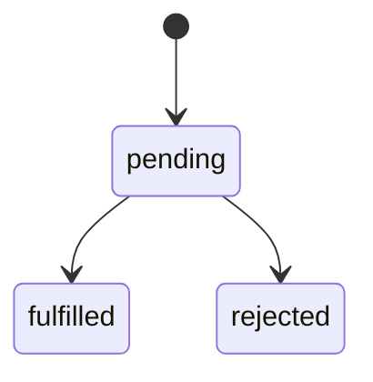

# 🎯 JavaScript Promises and Async/Await - L3

## Question
>
> **Core Question:** Explain JavaScript Promises, their states, and how async/await relates to them. Provide examples of error handling and chaining.
> **Category:** JavaScript

## 💡 Quick Answer (30 seconds)

- A Promise represents a future result of async work.
- States: **pending**, **fulfilled**, **rejected**.
- `async/await` is syntax on top of Promises that improves readability.
- Errors are handled with `.catch()` or `try/catch`.

## 📖 Simple Explanation

### Promise Lifecycle

| State     | Meaning                | Next Possible State   |
| --------- | ---------------------- | --------------------- |
| pending   | Work not finished      | fulfilled or rejected |
| fulfilled | Completed successfully | final                 |
| rejected  | Completed with error   | final                 |



### Promise vs Async/Await

| Style              | Best For                                  | Error Handling |
| ------------------ | ----------------------------------------- | -------------- |
| `.then()` chaining | Small pipelines or functional composition | `.catch()`     |
| `async/await`      | Multi-step business logic                 | `try/catch`    |

### Minimal Examples

```javascript
// Promise style
fetchUser()
  .then(user => fetchPosts(user.id))
  .then(posts => console.log(posts.length))
  .catch(err => console.error(err));
```

```javascript
// Async/await style
async function run() {
  try {
    const user = await fetchUser();
    const posts = await fetchPosts(user.id);
    console.log(posts.length);
  } catch (err) {
    console.error(err);
  }
}
```

### Common Combinators

| API                  | Behavior               | Use Case                  |
| -------------------- | ---------------------- | ------------------------- |
| `Promise.all`        | Fail fast if one fails | All dependencies required |
| `Promise.allSettled` | Wait for all outcomes  | Partial success reporting |
| `Promise.race`       | First settled wins     | Timeout strategies        |
| `Promise.any`        | First fulfilled wins   | Multi-source fallback     |

## ✅ Interview-Ready Summary

- Promises model async completion and failure explicitly.
- `async/await` improves readability but still uses Promises under the hood.
- Pick combinators based on failure tolerance and coordination needs.

## 📊 Confidence Level

- [ ] 🔴 Need to study (0-3)
- [ ] 🟡 Somewhat confident (4-6)
- [ ] 🟢 Very confident (7-10)
