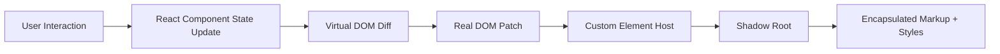

# Shadow DOM vs Virtual DOM

## Source

From: GPT

## Summary

- Shadow DOM (encapsulation/runtime boundary) and Virtual DOM (UI diffing/render strategy) solve different problems.
- Shadow DOM is browser-native for isolation; Virtual DOM is framework-level for efficient updates.

## Key Ideas

- **Shadow DOM**: Encapsulation for markup and style boundaries.
- **Virtual DOM**: In-memory diffing strategy for efficient rendering updates.
- **Different goals**: Isolation vs update performance.
- **Can coexist**: A React app can render custom elements that use Shadow DOM.
- **Details moved to spokes**: [[2026-03-06-shadow-dom]], [[2026-03-06-virtual-dom]].

### Visual layout

## Related

- [[2026-03-05-reconciliation]]
- [[2026-03-06-shadow-dom]]
- [[2026-03-06-virtual-dom]]
