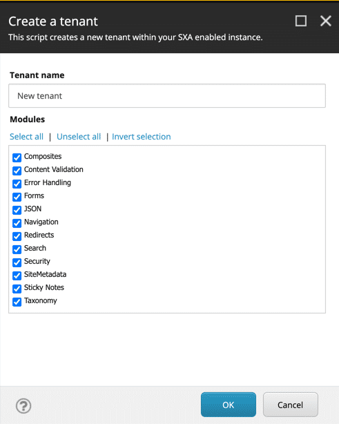

# Modules SXA

## Source

From: [Website](https://learning.sitecore.com/learn/learning-plans/26/sitecore-experience-accelerator-sxa-collection/courses/350/sxa-for-administrators/lessons/239:149/basics-for-administrators-45m)

## Summary

A module defines the isolation of features and functionality, allowing for greater discoverability and simplicity in the development process.

SXA modules group templates, branches, media library items, renderings, layouts, and more installed with a site or tenant. Always make sure to create your modules such that they are site context-aware, keeping in mind that not all Sitecore features are site context-aware. Use the Helix module and layer conventions to structure your tenants and sites to ensure it is easy to upgrade or update your solution.

## Key Ideas

| Module name | Functionality |
| --- | --- |
| Composites | Contains renderings such as Accordion, Carousel, Flip, Snippets, and Tabs to construct complex elements of web pages. |
| Error Handling | Allows you to specify pages that will be shown to the user when a page is not found or a server experiences a problem. |
| JSON | Enables SXA pages to be consumed by mobile apps and devices by exposing them in a more machine-friendly JSON format. |
| Navigation | Contains components that allow your visitors to navigate the site using concepts such as navigation, breadcrumb, and links/buttons. |
| Redirects | Allows you to define redirect rules to create vanity URLs and keep URLs that drive traffic to your website, ensuring that your website has the best possible SEO rating. |
| Search | Enables you to use Sitecore content search with rich filtering and presentation, including geospatial search, paging, infinite loader, and any sorting that you may need. |
| Security | Allows Admins to secure the website in a multi-role scenario where you have users of various proficiency and responsibility. |
| Page Content | Enables Content Editors to easily access fields on the page, along with Rich Text, Plain, and HTML. |
| Page Structure | It consists of renderings such as containers, dividers, splitters, toggles, and more, all of which support page structuring. |
| Creative Exchange | Allows your front-end developers to import and export their theme styling easily. |
| Local Data Sources | Provides locations for storing the content placed onto a page in a local folder, just underneath the page. |
| SiteMetadata | Provides metadata important for SEO, Sitemap, and social media, thus giving you the flexibility to have custom metadata. |
| Maps | Embeds maps from Google or Bing with locations, routes, and areas that you can mark. The component can also display POI results when associated with a search results source. |
| Sticky Notes | Allows your editors to collaborate more effectively through notes that you can attach to the components in Experience Editor. |
| Taxonomy | Provides tagging capabilities to your web content, enabling rich SEO and search scenarios. |
| Forms | Enables the functionality of dragging and dropping Sitecore Forms on your SXA pages. |

## Related

- [[2026-04-11-sxa]]
