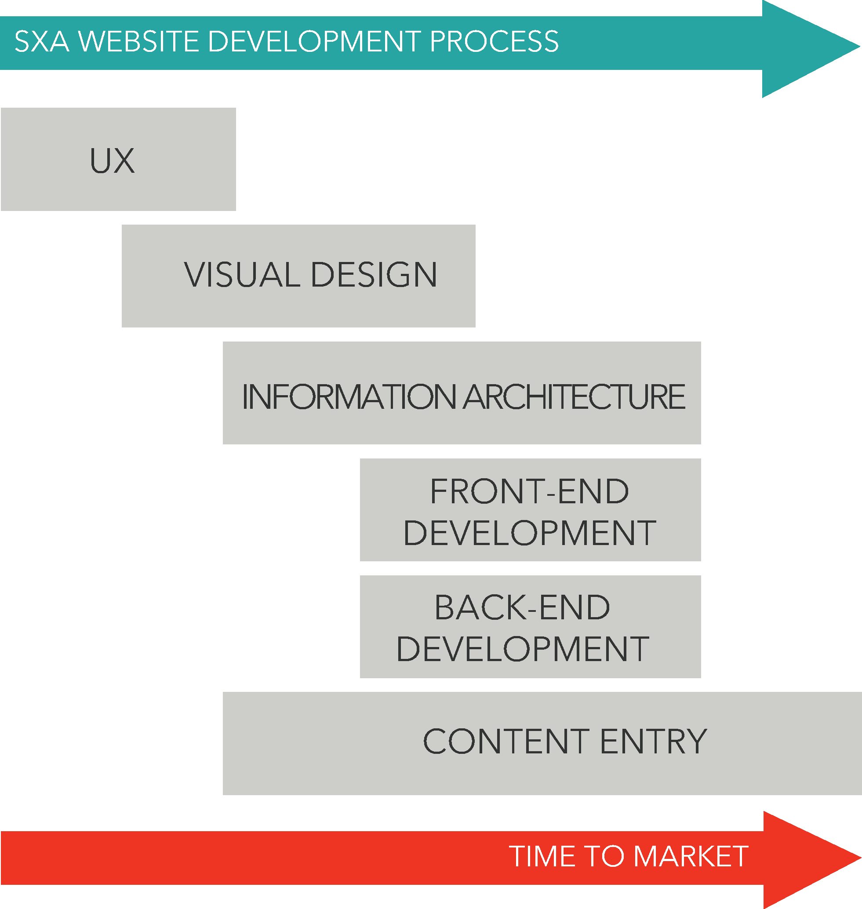

# SXA Terminology

## Source

- [Website](https://learning.sitecore.com/learn/learning-plans/26/sitecore-experience-accelerator-sxa-collection/courses/348/introduction-to-sitecore-experience-accelerator/lessons/232:144/examine-sitecore-experience-accelerator-its-benefits-45m)
- [Website](https://doc.sitecore.com/xp/en/users/sxa/104/sitecore-experience-accelerator/introduction-to-sitecore-experience-accelerator-1064950.html)

## Summary

Sitecore Experience Accelerator provides reusable, templated UX layouts and components to help you get up and running quickly.

## Key Ideas

### [[2026-04-11-tenants-sxa\|Tenant]]

Groupings in the business organization that need autonomy to manage their own sites, channels, and data, while at the same time wishing to share resources with other tenants.  
> Note: While tenants are conceptual entities in Sitecore, SXA defines tenants as a concrete entity.  
<https://doc.sitecore.com/developers/sxa/17/sitecore-experience-accelerator/en/create-a-tenant-and-a-site.htmlhttps://doc.sitecore.com/developers/sxa/17/sitecore-experience-accelerator/en/create-a-tenant-and-a-site.html>

### [[2026-04-11-modules-sxa\|Modules]]

Consists of templates, branches, settings (to store scaffolding items), media library items, renderings, layouts, and so on. Default SXA modules include the rendering sections, JSON site setup, and grid systems.

### [[2026-04-22-sitecore-page-designs-and-partial-designs|Page design & Partial designs]]

### Rendering variants

 Alternative adaptation of a single component; the component has one source with multiple visual options that the user controls.
 For example, a visual layout can be reused with different images and text to enhance personalization based on a viewer's mobility.

### Scopes and Facets

 Sitecore items that contain site-specific queries for providing search results. Scopes are used to limiting search results based on conditions, and facets are a way of refining search results by categorizing the items returned by the search.

### Themes

 The styling of your site is defined as the look and feel of a site and, within SXA themes, can be created separately from the site functionality and content. SXA themes contain CSS, JavaScript, images, and fonts and they can inherit from each other.

### Scriban

 A fast and extendable templating language used within SXA. Scriban templates are stored in your SXA rendering variants and can both coexist with the other renderers or replace the existing rendering variants.

### Creative Exchange Live

 A process that allows for the creative process to occur at the same time as site development. Front-end Developers can deploy their CSS, HTML, and script changes via gulp tasks while importing and creating Sitecore items simultaneously, allowing for immediate synchronization to the Sitecore environment.

## Related

- [[2026-04-11-modules-sxa]]
- [[2026-04-11-tenants-sxa]]
- [[2026-04-26-sxa-grid-systems]]

- User Experience
  - [[2026-04-26-sxa-author-productivity]]
  - [[2026-04-26-content-testing-on-partial-designs]]
