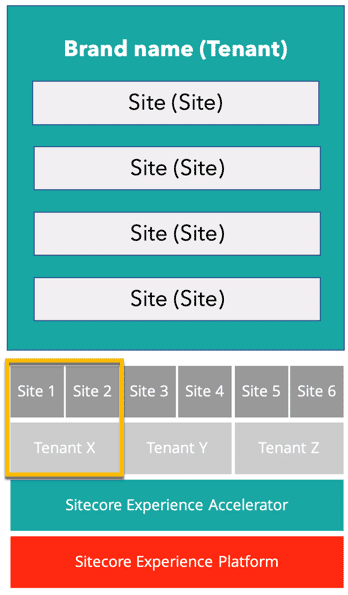
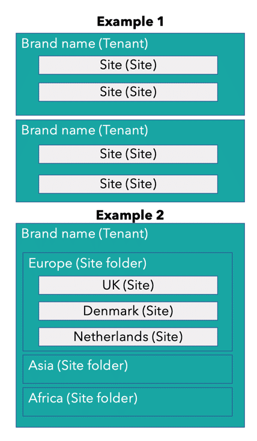

# Tenants and SXA

## Source

From: [Website](https://learning.sitecore.com/learn/learning-plans/26/sitecore-experience-accelerator-sxa-collection/courses/350/sxa-for-administrators/lessons/239:149/basics-for-administrators-45m)

## Summary

In SXA, a tenant is defined as an independent group of sites with its own set of templates and media items. A tenant often represents a brand and can include any number of related websites (see Figure 3). Typically a tenant is the equivalent of a business unit; the websites within the tenant are aligned to share a single Sitecore instance but are different enough to require their own data structures. Depending on the needs of your business, you may need to support multiple tenants within a shared environment and multiple sites under the same tenant; in such situations, you will be creating a multitenant and multisite solution.

## Key Ideas - Multitenancy in action

Multitenancy introduces a new level of governance that needs to be considered in both the architecture and management of the organization. The following two examples illustrate cases where a business may need to leverage a multitenant and multisite solution.

**Example 1:** A single brand can host numerous websites based on geographic region. The solution will then include multiple tenants, one for each geographic location, with each containing more than one website (see Example 1, Figure 4).

**Example 2:** A single brand can support localized markets via one-to-one translated versions, i.e., one tenant can have multiple sites grouped into their respective site folders for supporting local markets using native Sitecore language support

## Related

- [[2026-04-11-sxa]]
