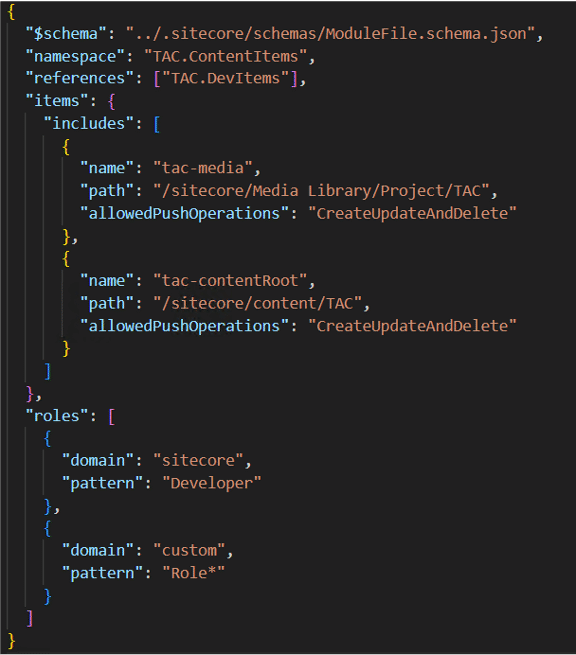
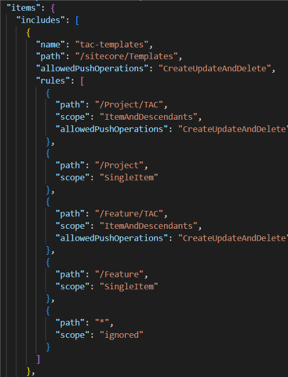
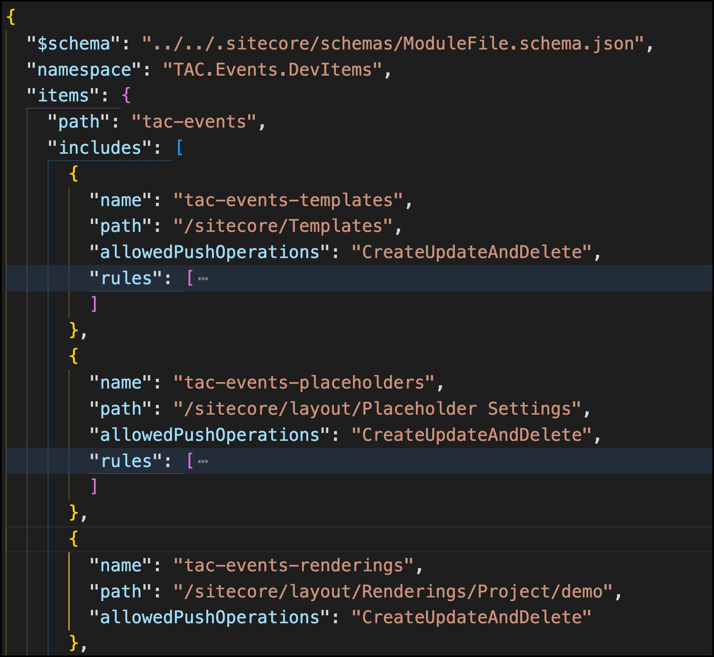
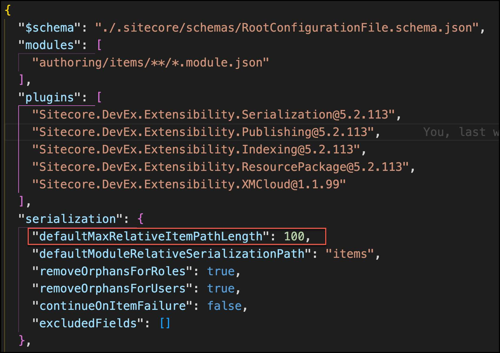
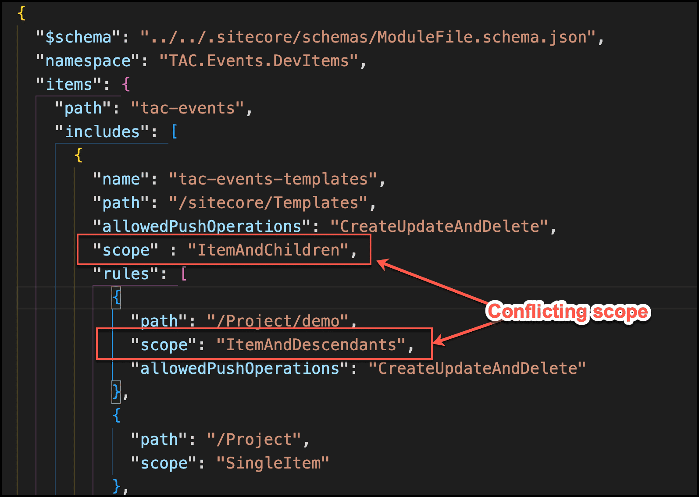
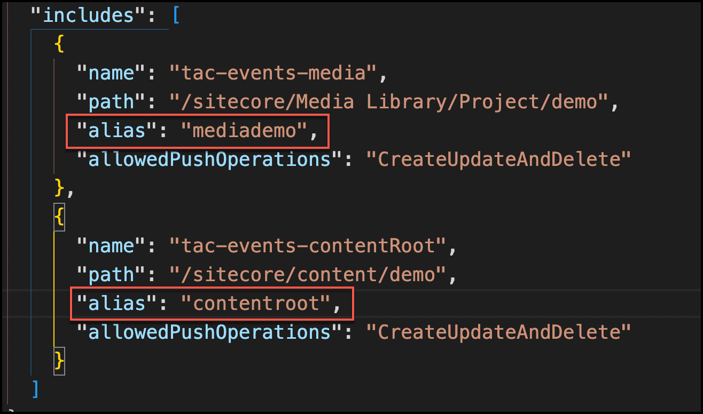

# Sitecore Content Serialization Modules-module.json

## Source

From: [Website](https://learning.sitecore.com/partners/learn/learning-plans/119/sitecoreai-cms-for-developers/courses/1598/sitecore-content-serialization/lessons/3056:1219/sitecore-content-serialization)

## Summary

👇 Serialization modules enable you to organize and separate serialized items according to their purpose and business domain. The recommended extension would be module name **.module.json**.

## Key Ideas

- A **namespace** is required
- The **references** property refers the namespace of other modules that must be deserialized first, such as dependencies like templates. This is important because a content item is only included once across all modules.
- Item include paths are configured in the **items** property
- Security accounts & domains can be serialized in the **roles** property

## Including and excluding content items

Your serialization module enables precise control over which content items are included in or excluded from the serialization process. This configuration can be defined and even overridden across all module files.

You can specify subsets of content items for serialization using **includes** and **rules**, a feature particularly useful for repeatedly serializing specific branches or parts of your content item tree.

### Properties in the "includes" property

- **name** property in each includes property becomes the folder name
- **path** determines where to serialize
- **allowedPushOperations**:

  - CreateOnly
  - CreateAndUpdate
  - CreateUpdateAndDelete (default)
- Can include roles and users to serialize
- Order is important

### Applying rules within the "includes" property

- Used to exclude and include content items relative to the path in the includes property
- Rule system works by the **first-match-wins** principle
- **scope** property specify the range of paths the rule applies to:

  - Ignored
  - SingleItem
  - ItemAndChildren
  - ItemAndDescendants

The first rule directs SCS to serialize all content items in the "TAC template" folder; if this rule matches, subsequent rules are ignored.

## What items should be serialized

Items created by developers must be serialized if code depends on them. Out of the box items provided by the base XM Cloud installation should not be serialized. In XM Cloud, the following items require serialization:

- **Modules **from the* /sitecore/system/settings/project* folder, each site collection must have a corresponding headless module created
- **Templates**from project folder that have been created during site collection creation: */sitecore/templates/Project/&lt;site collection name&gt;*
- **Branch Templates** from project folder: */sitecore/templates/Branches/Project/&lt;site collection name&gt;*
- **Media Library Folder** with the shared and *&lt;site name&gt;* related folder only, not including media assets: */sitecore/media library/Project/&lt;site collection name&gt;*
- **Layouts**in case there are any custom ones: */sitecore/layout/Layouts/Project/&lt;site collection name&gt;*
- **Rendering Items** from Project folder: */sitecore/layout/Renderings/Project/&lt;site collection name&gt;*
- **Placeholder settings** from Project folder. A Folder for our custom Placeholder settings has been created already with the tenant creation: */sitecore/layout/Placeholder Settings/Project/&lt;site collection name&gt;*
- The **site collection** root item: */sitecore/content/&lt;site collection name&gt;*
- The **site root** item (incl. the automatically created items like): */sitecore/content/&lt;site collection name&gt;/&lt;site name&gt;*

  - Home Item: */sitecore/content/&lt;site collection name&gt;/&lt;site name&gt;/Home*
  - The Media Item: */sitecore/content/&lt;site collection name&gt;/&lt;site name&gt;/Media*
  - The Data item with it’s direct children for the different data source folders: */sitecore/content/&lt;site collection name&gt;/&lt;site name&gt;/Data*
  - Dictionary item incl. all subitems: */sitecore/content/&lt;site collection name&gt;/&lt;site name&gt;/Dictionary*
  - The Presentation section incl. all subitems: */sitecore/content/&lt;site collection name&gt;/&lt;site name&gt;/Presentation*
  - The Settings sections incl. all subitems: */sitecore/content/&lt;site collection name&gt;/&lt;site name&gt;/Settings*

## SCS Best practices

Effectively managing content serialization is crucial for a smooth development and deployment workflow. Adhering to these best practices for Sitecore Content Serialization (SCS) will optimize your team's efficiency and prevent common issues.

### Module configuration order

*"Adhering to a Dependency-First Approach in module.json"*

The order in which items are configured within your module.json files is vital for successful serialization.

- **Golden Rule** - Always define all dependencies before the items that depend on them.
- **Correct Sequence** - Follow this recommended order for item serialization:

    1. Templates
    2. Layouts
    3. Renderings
    4. Content items
- **Rationale** - This sequence ensures that all necessary item relationships are correctly established, preventing serialization errors during deployment.

### Path configuration management

"*Ensuring Correct Relative Serialization Paths*"

Once dependencies are handled, managing path lengths is critical to avoid file system limitations that can prevent serialization or deployment entirely.

- **SCS Default Limit** - By default, SCS limits content serialization path sizes to 100 characters, though this setting is configurable
- **Path Calculation Formula** - The maximum relative item path length is calculated as: File system max path length - (Base path length + Serialization path length)
- **Action Required**- Proactively review and adjust your path length limits based on your project's specific structure and underlying file system constraints

### Rules configuration strategies

"*Applying the First-Match-Wins Principle*"

After establishing foundational structure and managing paths, precisely controlling ***what*** gets serialized and how conflicts are resolved (via rules) becomes crucial for accurate content deployment.

When configuring rules for content synchronization, the first rule that matches a content item will be applied, and all subsequent rules will be disregarded for that item.

**Here are some guidelines:**

- **Avoid Overlap** - Prevent path overlaps between different rules to avoid conflicts
- **Parent Precedence** - Be aware that parent rules will override child rules
- **Scope Limitations**: **Rules**scopes cannot exceed the inclusiveness of the **root**scope

  - **Example**: If the root scope is ***ItemAndChildren***, a rule's scope cannot be ***ItemAndDescendants***

> **Note:** The **Include** property offers an optional **scope** setting with four possible values: **SingleItem**, **ItemAndChildren**, **ItemAndDescendants**, and **DescendantsOnly**. Its default value is **ItemAndDescendants**.

In contrast, the **Rules** property also has a **scope** property, which can be set to **Ignored**, **SingleItem**, **ItemAndChildren**, or **ItemAndDescendants**. Unlike Include, the Rules property's scope has no default value.

Please refer to:[(opens in a new tab)](https://doc.sitecore.com/sai/en/developers/sitecoreai/sitecore-content-serialization-configuration-reference.html#scope)[https://doc.sitecore.com/sai/en/developers/sitecoreai/sitecore-content-serialization-configuration-reference.html#scope(opens in a new tab)](https://doc.sitecore.com/sai/en/developers/sitecoreai/sitecore-content-serialization-configuration-reference.html#scope)

### Path optimization strategies

"*Leveraging Hashing and Aliases for Efficiency*"

Implement strategies to optimize your content item paths, enhancing both manageability and readability. Employ hashing and aliases to shorten paths and improve their human readability.

- **Dual Benefits**:

  - Mitigate risks associated with serialization path length limitations.
  - Facilitate clear project structure with meaningful aliases.

### Regular Synchronization and Validation

"*Maintaining Content Consistency*"

- **Regular Sync** - Routinely synchronize content items to disk to ensure your serialized content is always up-to-date with the Sitecore instance.

  - **Example**: After making changes in Sitecore, run ***dotnet sitecore ser pull*** to bring those changes to your local file system. This ensures your local serialized items reflect the latest state.

- **Validation** - After each sync, validate the serialized content to catch any inconsistencies or errors early in the development cycle.

  - **Example**: Run ***dotnet sitecore ser validate*** or reviewing your source control changes (e.g.: Git diff) after a pull can help identify unexpected modifications or missing items.

### Leverage Source Control

"*Tracking and Managing Changes*"

- **Source Control Integration** - Always store your serialized Sitecore items in a robust source control system (e.g.: Git).

  - Treat serialized Sitecore items like any other code artifact. Commit them regularly to your Git repository. This ensures a single source of truth for your content definitions and allows for collaborative development.
- **Version Tracking** - This enables comprehensive version tracking, allowing you to review changes, revert to previous states, and collaborate effectively with team members.

  - **Example**: If a bug is introduced due to a recent content change, you can easily use Git to compare versions, pinpoint the exact modification, and revert to a stable state if necessary. For team collaboration, developers can branch off, make their item changes, and then merge their serialized items, resolving any conflicts just like code.

## Related

- [[2026-04-15-sitecore-project-configuration-sitecore-json]]
- [[2026-06-02-sitecore-cli]]
