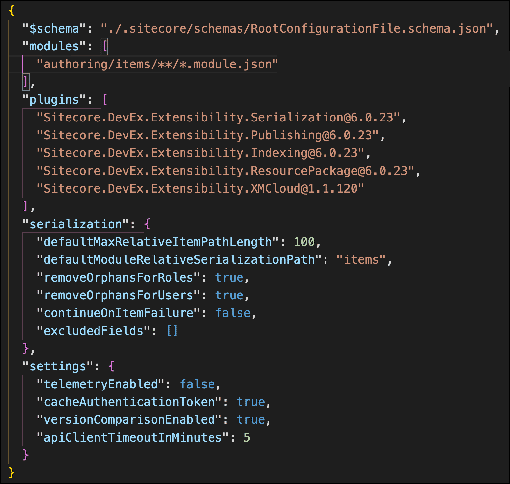

# Project configuration sitecore.json

## Source

From: [website](https://learning.sitecore.com/partners/learn/learning-plans/119/sitecoreai-cms-for-developers/courses/1598/sitecore-content-serialization/lessons/3056:1219/sitecore-content-serialization)

## Summary

👇 The **sitecore.json**file contains the configuration for Sitecore CLI and includes the configuration for Sitecore Content Serialization. There are a number of properties that can be configured.

## Key Ideas

- File name: **sitecore.json**
- Located at the root folder of the project
- Specifically for SCS, the folder where modules are located are specified in the **modules** property
- Can specify fields to exclude from serialization
- Serialize manually or on demand using Sitecore CLI pull and push commands
- Serialize automatically using Sitecore CLI with watch command enabled to monitor changes in Sitecore

## Related

- [[2026-04-15-sitecore-content-serialization-module-json]]
- [[2026-04-15-sitecore-how-items-are-deployed-to-xm-cloud]]
