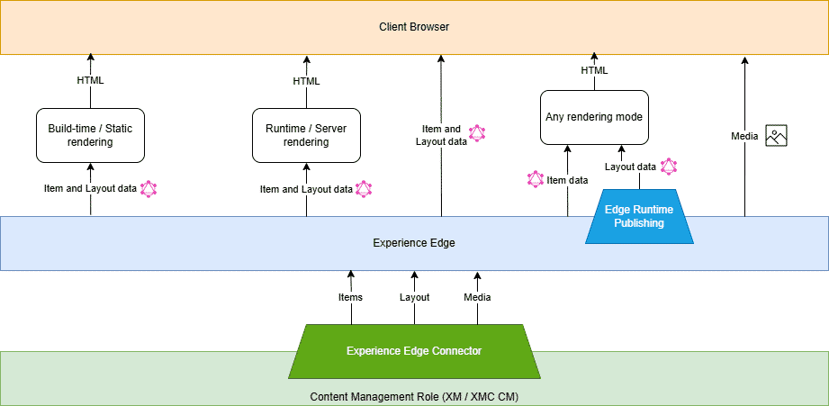

# Architecture of Experience Edge

## Source

From: [Website](https://learning.sitecore.com/partners/learn/learning-plans/119/sitecoreai-cms-for-developers/courses/1597/wed-development-with-sitecoreai-cms/lessons/3055:1218/web-development-with-sitecoreai-cms)

## Summary

Sitecore Experience Edge is the delivery layer for published content in SitecoreAI. It provides scalable, high-performance content delivery through globally distributed APIs, helping reduce infrastructure complexity while improving front-end development and user experience.

A headless delivery platform that exposes content and layout data via a GraphQL API and media via a CDN



## Key Ideas

### The Experience Edge delivery platform

- **Delivery Endpoint Access:** Provides a GraphQL API to retrieve all published content.
- **Data Exposure:** Experience Edge exposes item and layout data via its GraphQL API and media assets through a CDN.
- **Flexible Data Querying:** Query item and layout data for:

  - Static site generation (build-time).
  - Server-Side Rendering (SSR) or Incremental Static Generation (ISG) (runtime).
  - Client-Side Rendering (CSR) directly from the browser.

### The Sitecore CLI Edge plugin

The Sitecore CLI Experience Edge plugin provides commands for logging in, listing and choosing a tenant, and managing API keys for accessing the GraphQL endpoint from your preferred command line interface. The plugin is available for Sitecore CLI version 5.1.25 and later.

Install Sitecore CLI Edge plugin:

```ps
dotnet sitecore plugin add -n Sitecore.Edge.DevEx.Sitecore.Plugin
```

## Related

- [[2026-04-20-sitecore-apis]]
- [[2026-04-20-experience-edge-webhooks]]
- [[2026-04-20-experience-edge-admin-api]]
- [[2026-06-02-experience-edge-schema]]
