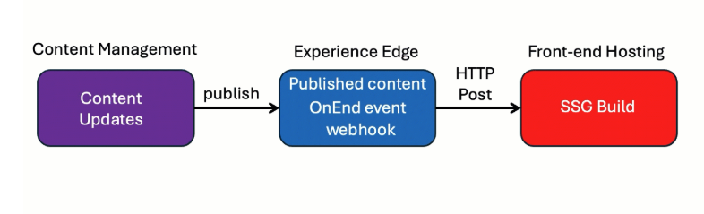

# [[2026-04-20-experience-edge-architecture|Experience Edge]] Webhooks

## Source

From: [Website](https://learning.sitecore.com/partners/learn/learning-plans/119/sitecoreai-cms-for-developers/courses/1593/sitecore-apis-and-webhooks/lessons/3044:1214/sitecore-apis-and-webhooks)

## Summary

## Understanding [[2026-04-20-experience-edge-architecture|Experience Edge]] Webhooks

[[2026-04-20-experience-edge-architecture|Experience Edge]] webhooks are a mechanism that allows your [[2026-04-20-experience-edge-architecture|Experience Edge]] tenant to notify external applications about events in real-time. They're especially valuable for:

- Informing external clients about content updates.
- Triggering automated actions like cache clearing.
- Building integration workflows with other systems.
- Launching builds of static sites when content changes.

## Key Ideas

### Webhook Example

One of the most common webhook implementations is triggering static site builds:

1. New or updated content approved and published to [[2026-04-20-experience-edge-architecture|Experience Edge]].
2. Create and configure a webhook in Edge to trigger at the end of publishing job.
3. The webhook calls your build system (e.g., Netlify, Vercel, Jenkins) with the payload.
4. Your build system pulls the latest content via the GraphQL Content Delivery API.
5. A new static site is generated and deployed.

### Execution mode

The execution of webhooks is controlled by the selected mode, dictating the **timing** and **data** included. The following two modes are available:

- **OnEnd (Default)** - Executes ***after*** publishing; body format is configurable via the content-type header (e.g., text/plain, application/json).
- **OnUpdate** Executes ***with*** the content changes that caused it; body format is always application/json.

### Configure and manage Edge Webhooks

The Edge Admin APIs include the following endpoints for managing and configuring webhooks:

- **ListWebhooks** - lists all webhooks for a tenant.
- **CreateWebhook** - creates a new webhook.
- **UpdateWebhook** - updates an existing webhook.
- **GetWebhookById** - gets a specific tenant webhook.
- **DeleteWebhook** - deletes a specific webhook.

## Related

- [[2026-04-20-experience-edge-admin-api]]
- [[2026-04-20-experience-edge-architecture|Experience Edge]]
