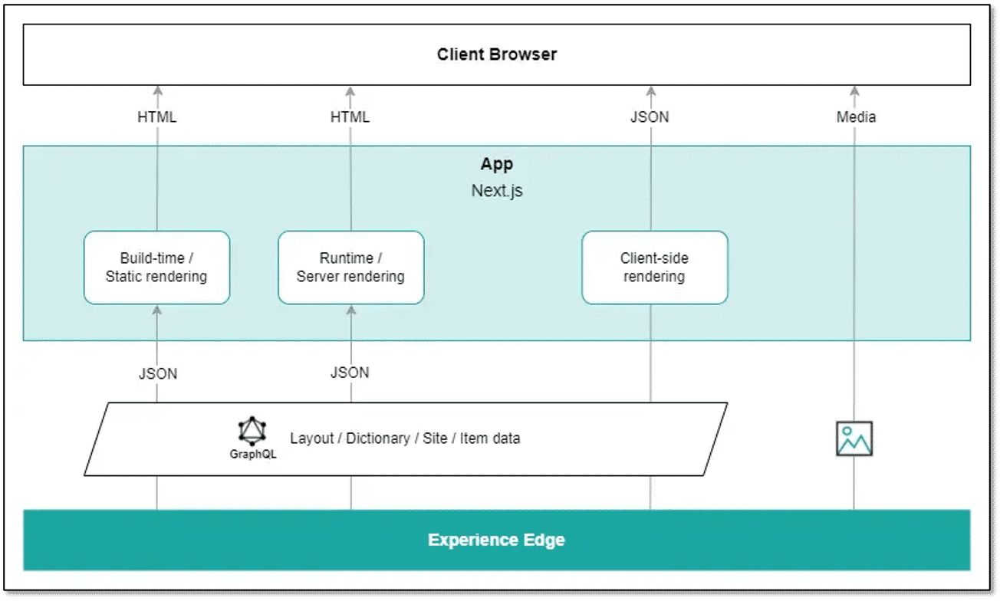

# What is Sitecore Content SDK

## Source

From: [Website](https://learning.sitecore.com/partners/learn/learning-plans/119/sitecoreai-cms-for-developers/courses/1597/wed-development-with-sitecoreai-cms/lessons/3055:1218/web-development-with-sitecoreai-cms)

## Summary

The Sitecore Content SDK is a modern, headless development toolkit built for SitecoreAI. It replaces the older JSS SDK for front‑end (‘Head’) development and provides a faster, more scalable way to build personalized digital experiences.

## Key Ideas

Using Content SDK with SitecoreAI CMS allows for:

- **Core SDKs** - Fundamental SDK functionality for efficiently retrieving Sitecore data and managing layout within JavaScript applications, integrating with various Sitecore services and APIs.
- **Framework-Specific SDKs** - SDKs designed to streamline the development of JavaScript applications using popular frameworks like Next.js. These SDKs facilitate rendering Sitecore dynamic placeholders, provide components, and offer helpers for rendering Sitecore fields while preserving authoring editability for layout and field values.
- **Sample Applications** - Ready-to-use application templates for frameworks such as Next.js, enabling developers to quickly scaffold applications for displaying Sitecore data.
- **Developer Tools and Utilities** - Supporting tools and utilities for enhanced developer experience.
- **Scalability & Performance** - SitecoreAI CMS leverages cloud-native infrastructure. Content is typically delivered via Sitecore [[2026-04-20-experience-edge-architecture|Experience Edge]], a globally distributed delivery platform, ensuring high performance and scalability for the Content SDK application.
- **Personalization & Authoring Experience** - While headless, Content SDK application with SitecoreAI CMS still allows marketers to use Sitecore's powerful personalization features and visual authoring tools like SitecoreAI CMS Page builder.

## Related

- [[2026-04-20-contentsdk-field-helpers]]
- [[2026-04-20-sitecore-client-api]]
