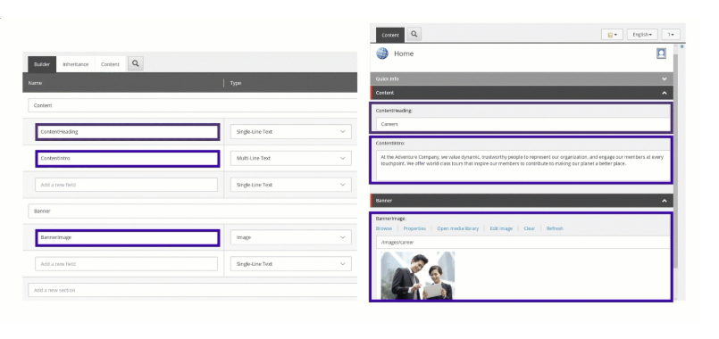
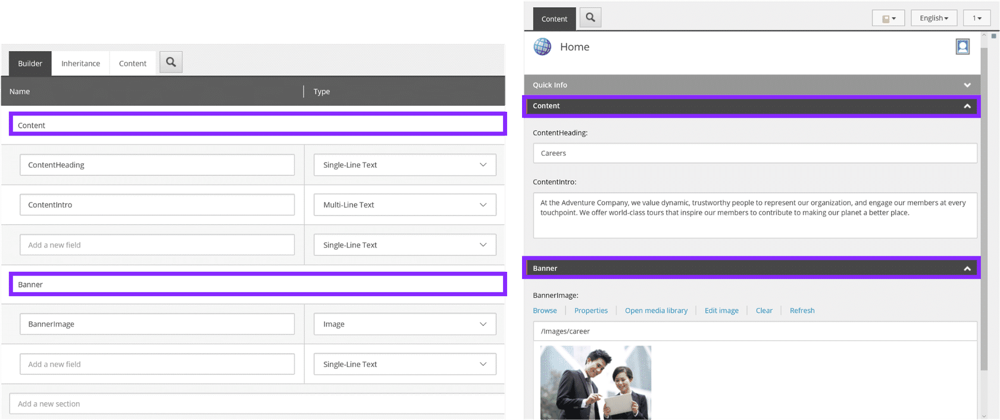
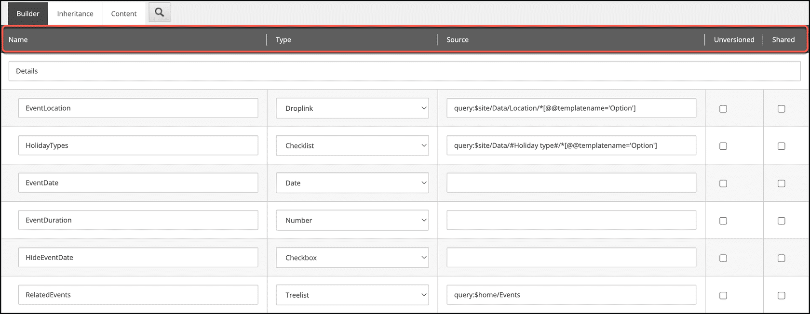
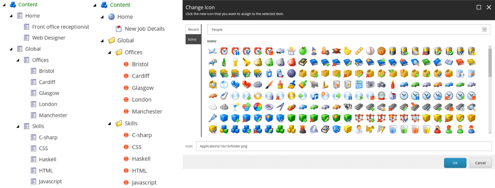
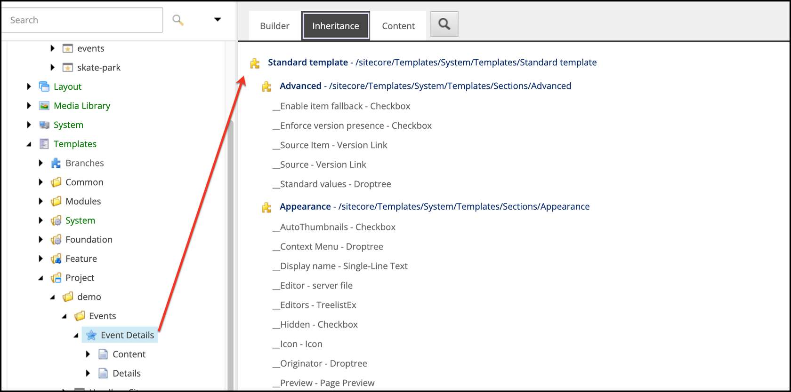

# Sitecore content modeling

## Source

From: [Website](https://learning.sitecore.com/partners/learn/learning-plans/119/sitecoreai-cms-for-developers/courses/1594/content-modeling/lessons/3046:1215/content-modeling)

## Summary

Everything in SitecoreAI is an **item**. Items represent all content and configuration elements stored in a hierarchical content tree. Items can be:

- Web pages
- Components
- Pure data entities
- Configuration elements

Every item in SitecoreAI is based on a **template**. Templates define:

- The **structure** of an item
- The **type** of an item

## Key Ideas

### Data Templates as Content Models

🎯 *Data templates* specifically define the structure of content items:

- They serve as the content model for your data.
- They determine what fields and values an item can contain.
- They establish relationships between different content types.

💡 *Content modeling* is a fundamental step in Sitecore development:

- It defines how content is structured, related, and reused.
- It directly impacts the flexibility and scalability of your implementation.
- It shapes the authoring experience for content editors.
- Effective modeling should be done *before* jumping into SitecoreAI.

### Content modeling in SitecoreAI involves

- Creating data templates
- Defining standard values
- Assigning insert options
- Creating content items

### Anatomy of a template

When creating a data template, it's helpful to think of it as designing a database table. Just as you would define columns and their corresponding data types in a table, you do the same in a template

#### Fields

**Fields** are the fundamental units of content in a template:

- Each field represents a single piece of information.
- Fields have types that determine what kind of data they store.
- Fields are where content authors input their content.

#### Fields Sections

**Field sections** group related fields which provides:

- Improved navigation in the Content Editor.
- Expandable or collapsable groups.
- Logical groupings of information.
- Consistent section names across templates, improving the authoring experience.

#### Field Property

- **Name**: Name of the field
- **Type**: Selection of field types
- **Source**: Configures field-specific options
  - For Image/File: Sets browsing location
  - For Rich Text: Configures toolbar options
  - For Droplink: Sets the source of selectable items
- **Versioning Options**:
  - Versioned (default): Unique data per language and version
  - Shared: Data shared across all languages and versions
  - Unversioned: Unique per language, shared across versions

#### Template Icons

Icons help content authors quickly identify item types in Content Editor by:

- Setting icons on the template item itself.
- Providing visual cues in the content tree.
- Supporting content management at scale.

## Template inheritance

Template inheritance is one of SitecoreAI's most powerful features, allowing you to build complex content structures from simpler, reusable templates. This approach follows object-oriented design principles that promote consistency and maintainability across your content model.

### How template inheritance works

When a template inherits from another template:

- **All fields** from the base template are automatically included in the inheriting template.
- **Sections** from base templates are merged with the inheriting template.
- Changes to base templates automatically propagate to all inheriting templates.
- Multiple inheritance is supported, allowing templates to inherit from several base templates.

### The Foundation: *Standard Template*

Every template in SitecoreAI ultimately inherits from the system's ***Standard Template***:

- Serving as the root of all template inheritance hierarchies.
- Providing essential system fields.
- Normally hidden from view in the Content Editor.
- Should never be modified due to its critical importance.

## **Inheritance best practices**

👇 Follow these guidelines for effective template inheritance:

- Limit hierarchy complexity.
- Prevent "inert fields" (inherited but irrelevant fields).
- Never duplicate field names across inheritance chain.
- Avoid cyclic inheritance references.
- Use editor-friendly names.
- Work with conventions.

Ensure mandatory inheritance from the ***Standard Template***.

## Related

- [[2026-04-21-standard-values]]
- [Sitecore Marketplace SDK - client package](https://www.npmjs.com/package/@sitecore-marketplace-sdk/client)
- [Sitecore Marketplace SDK - xmc package](https://www.npmjs.com/package/@sitecore-marketplace-sdk/xmc)
- [Marketplace Starter](https://github.com/Sitecore/marketplace-starter)
