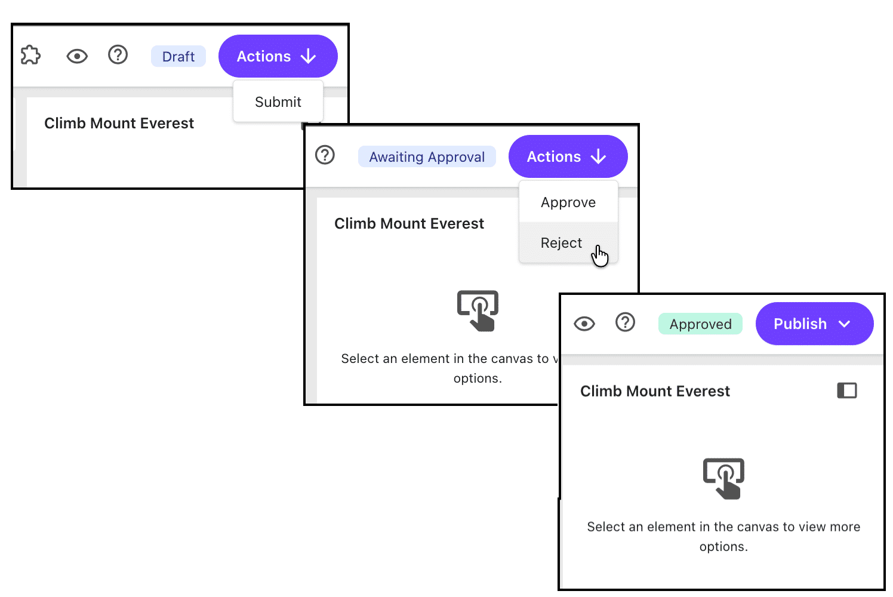
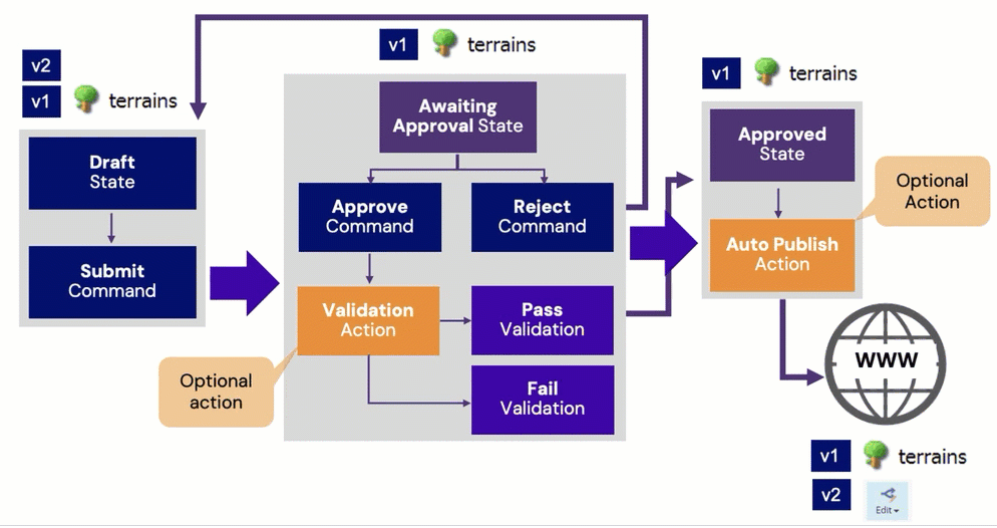
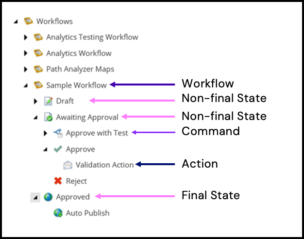
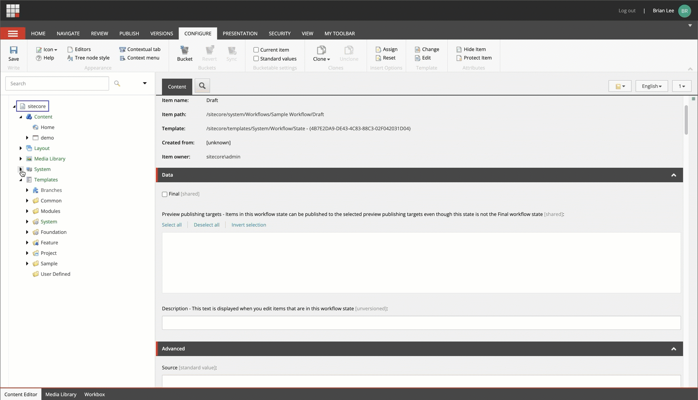
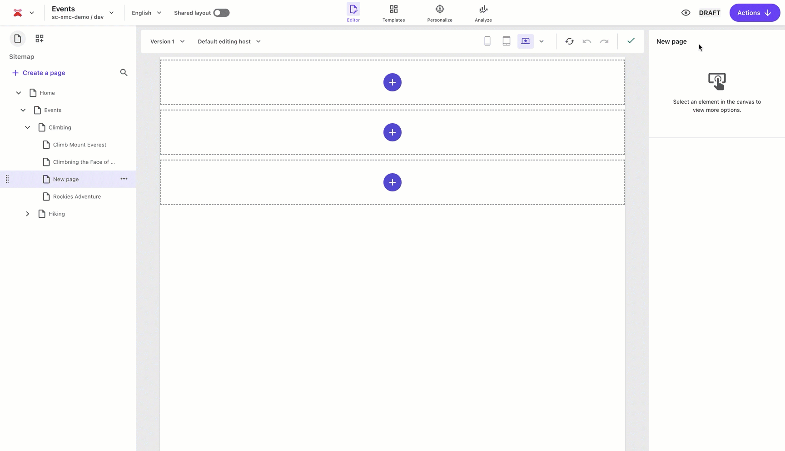

# Sitecore workflows

## Source

From: [Website](https://learning.sitecore.com/partners/learn/learning-plans/119/sitecoreai-cms-for-developers/courses/1594/content-modeling/lessons/3046:1215/content-modeling)

## Summary

By default, your items are publishable from the moment they are created.  This can lead to newly created items being published before the content is finalized. To prevent this, it is strongly recommended that you implement Workflows for all content items.

## Key Ideas

### A workflow is

- A series of steps that an item versions flow through from creation to publication.
- Created to meet organizational needs.
- Assigned to template's Standard Values.

### Purpose

- Providing visibility into content status.
- Ensuring proper review and approval.
- Preventing accidental publishing of unfinished content.

### Anatomy of a workflow

A workflow and all its elements are defined as items like everything in SitecoreAI. These items are stored in the content tree under `/sitecore/System/Workflows`.

### Workflow consists of State, Commands and Actions

#### State

States are the fundamental building blocks of workflows. They represent the distinct phases content passes through during its lifecycle.

- Each workflow has an **Initial State** field that determines which state new content is assigned when it enters the workflow.
- States can be marked as **Final** by checking the Final checkbox.
- Content items in a **Final** state are publishable.
- When a user edits content in a **Final** state, Sitecore automatically creates a new version and moves it to the Initial state.

#### Commands

Commands enable users to **move** content from one state to another. They appear in these places:

1. On the Top toolbar of Page builder ( In Page builder Commands are executed as Actions).
2. On the Review tab in the Workflow group in the Content Editor.
3. In the Workbox interface.

Commands are only visible when:

- The content item is in the corresponding state.
- The user has appropriate access permissions.

#### Actions

Actions represent methods that Sitecore executes at specific points in the workflow process. They are the "workers" that perform operations when workflow events occur.

Actions can be associated with:

1. States - Actions executed when content enters the state.
2. Commands - Actions executed when a user triggers the command.

Common usage of:

State Actions

- Send email notifications to reviewers when content enters the "Awaiting Approval" state.
- Log content changes when items enter a new state.
- Automatically assign content to specific users.

Command Actions

- Validate content before allowing a state transition.
- Update related content items.
- Trigger external systems via webhooks.

### Three types of SitecoreAI webhooks

#### Webhooks submit action

- Triggers when items change workflow state.
- Fires when workflow commands execute.
- Focuses primarily on workflow actions.
- Enables workflow-based integrations.

**Submit Action Example:**

Send a HTTP request to an endpoint when content enters the "Awaiting Approval" state.

#### Webhooks validation action

- Provides third-party services the ability to approve/reject workflow state changes.
- Acts as a gatekeeper for workflow transitions.
- Can block state transitions based on external validation.

**Validation Action Example:**

Check content for compliance issues using an external API before allowing transition to the "Approved" state.

### Webhooks event handler

- Triggers on supported system events.
- Provides information about the event.
- Key events include:
  - `item_added`
  - `item_clonedAdded`
  - `item_copied`
  - `item_deleted`
  - `item_deleting`
  - `item_locked`
  - `item_unlocked`
  - `item_moved`
  - `item_renamed`
  - `item_saved`
  - `item_sortorderChanged`
  - `item_templateChanged`
  - `item_versionAdded`
  - `item_versionRemoved`
  - `publish_begin`
  - `publish_end`
  - `publish_fail`
  - `publish_statusUpdated`

**Webhook Event Handler Example:**

Monitor `item_saved` event on items with a specific template.

## Creating and configuring a Webhook Submit Action

The Submit action will trigger on workflow status changes and is focused on workflow actions.

**Step 1: Open the workflow command**  

Navigate to ***Workflows/Event Approval Workflow/Draft/Submit***, insert the "Webhook Submit Action", and name it "Notify JIRA".  

**Step 2: Configure the webhook action**  

Assuming no authorization is required for this endpoint, enter the endpoint URLin the **Url** field (for example, <https://webhook.site/20a057c3-b802-4178-a129-3582ead71534>) and check "**Enable**".  

**Step 3: Save the workflow action**  

Click **Save** to apply the webhook configuration.

## Related

- [[2026-06-06-__onsave-command]]
