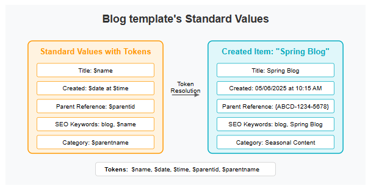

# Standard Values

## Source

From: [Website](https://learning.sitecore.com/partners/learn/learning-plans/119/sitecoreai-cms-for-developers/courses/1594/content-modeling/lessons/3046:1215/content-modeling)

## Summary

Standard Values are a fundamental concept in SitecoreAI that allow developers and content authors to work more efficiently by automatically pre-populating fields with default content. Combined with tokens, they provide a powerful way to create dynamic, intelligent templates that reduce manual effort and ensure consistency across your website.

## Key Ideas

### Standard Values: Setting defaults

Standard Values provide default settings for items created from a template. Think of them as the "factory settings" that will automatically be applied when a new content item is created.

👇 Following are the key characteristics of Standard Values:

- **Storage Location** - Standard Values are stored on a special `__Standard Values` item, which is a child of the template.
- **Default Field Population** - They set initial values for fields (default and dynamic).
- **Default Presentation** - They configure initial renderings and layout.
- **Default Workflow** - They configure initial workflow for item.
- **Default Insert Options** - They configure types of items can insert under existing items.
- **Applied at Creation** - Values are applied when items are created from the template.
- **One-time Application** - Changes to Standard Values don't affect existing items.

### Tokens in Standard Values

Tokens are placeholders that get replaced with dynamic values when a new item is ***created***. They make your Standard Values even more powerful.

Common tokens and their uses:

| Token         | Description      | Example Use Case             |
| ------------- | ---------------- | ---------------------------- |
| `$name`       | Item name        | Auto-populate title field    |
| `$id`         | Item ID          | Create unique references     |
| `$parentid`   | Parent item ID   | Link to parent container     |
| `$date`       | Current date     | Set publication dates        |
| `$time`       | Current time     | Track creation time          |
| `$parentname` | Parent item name | Inherit category information |

👇 The following figure illustrates the resolution of tokens during item creation from a template where tokens exist in the `__Standard Values`.

- Tokens are dynamically resolved during creation.
- Tokens can be combined (e.g.: $date at $time).
- Values generated by tokens can be edited (e.g: Title field value can be edited after initial value from $name).
- Standard Values with tokens can be inherited and overridden by child template's Standard Values.

## Related

- [[2026-04-21-sitecore-content-modeling]]
