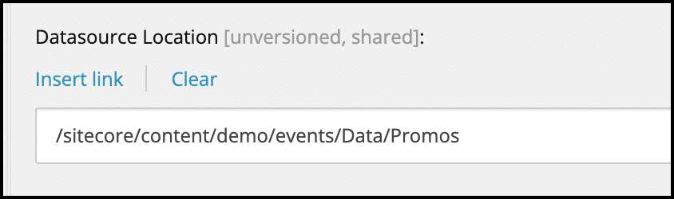
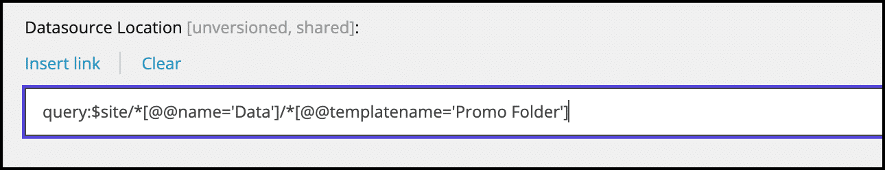
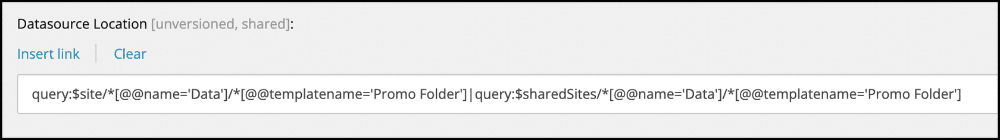
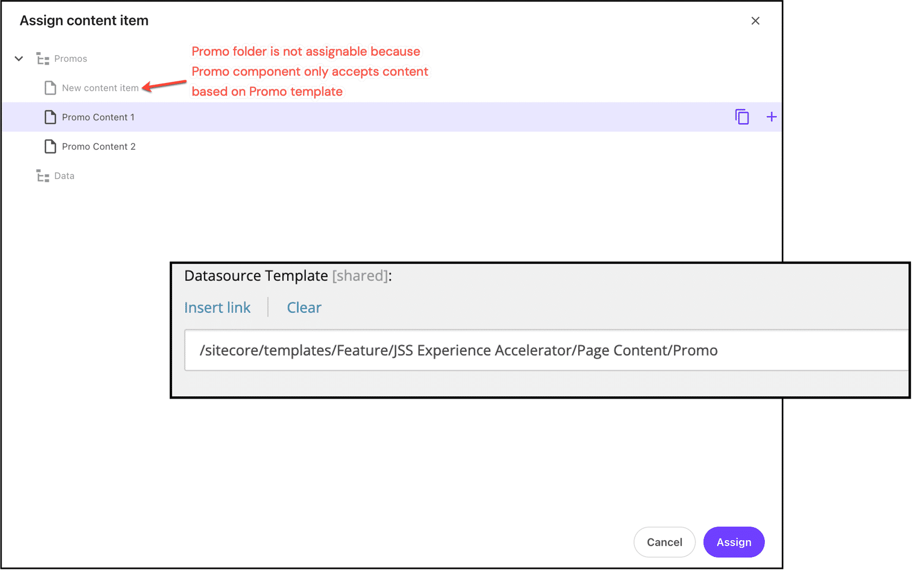

# Datasources in component

## Source

From: [Website](https://learning.sitecore.com/partners/learn/learning-plans/119/sitecoreai-cms-for-developers/courses/1595/renderings-and-layouts/lessons/3048:1216/renderings-and-layouts)

## Summary

Data sources allow components to reference content from **anywhere** in the content tree. This separation between presentation and content enables greater flexibility, reusability, and manageability of content across your digital experiences.

Sitecore uses data sources to:

- Separate content from presentation.
- Enable content reuse across multiple pages.
- Allow content authors to modify component-specific content without changing the page structure.
- Support personalization and multivariate testing at the component level.

## Key Ideas

### Datasource architecture in SitecoreAI

In SitecoreAI, the datasource architecture consists of three critical properties:

- **Datasource** - Linked content item ID.
- **Datasource Location** - Allowed paths for creating/selecting datasource items.
- **Datasource Template** - Data template for new datasource items.

### Configure datasource location

Datasource Location is a property on a rendering (component) that defines where content authors can create or select content items to associate with that rendering. It determines the **scope** of the content tree available for datasource selection.

SitecoreAI supports several types of datasource location references:

- Absolute Path - Direct reference to a specific location in the content tree
    Example: Use Insert link to select the location
    
- Query - Dynamic location based on Sitecore Query syntax
    Example:
    query:/*[@@name='Data']/*[@@templatename='Promo Folder']
    
- Multiple Locations - Pipe-separated list of locations
    Example:
    combining multiple Sitecore Query
    query:/*[@@name='Data']/*[@@templatename='Promo Folder'] | query:/*[@@name='Data']/*[@@templatename='Promo Folder']
    

### Configure datasource template

The Datasource Template property is a critical configuration setting on SitecoreAI renderings that specifies which template can be used when creating datasource items for a component. This property:

- Controls which content structure is available to the component.
- Ensures that renderings receive compatible data structures.
- Guides content authors to create appropriate content.
- Enforces data integrity in the content creation process.

## Related

- [[2026-04-22-sitecore-renderings-components]]
