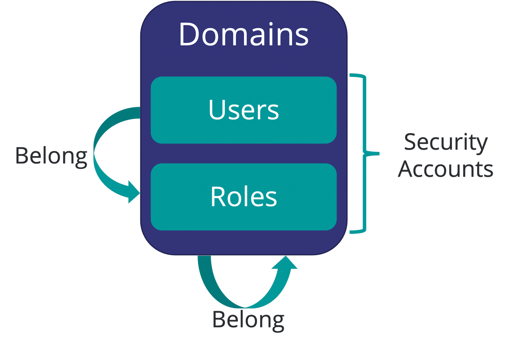
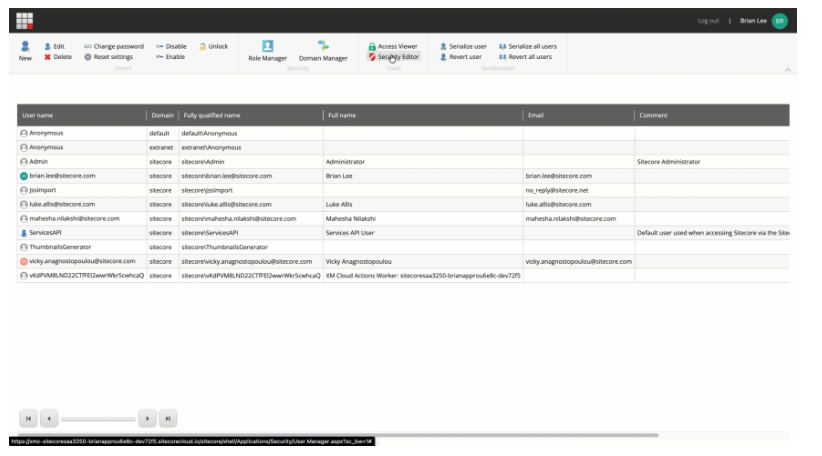
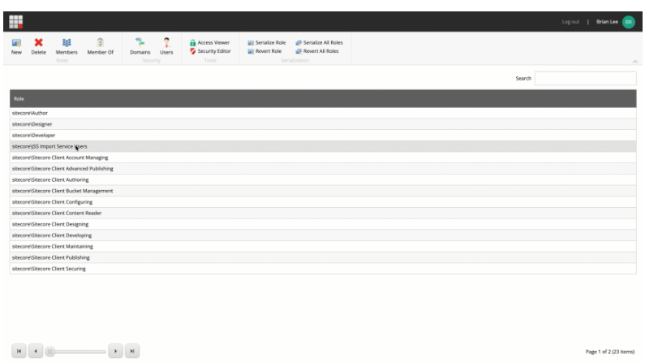
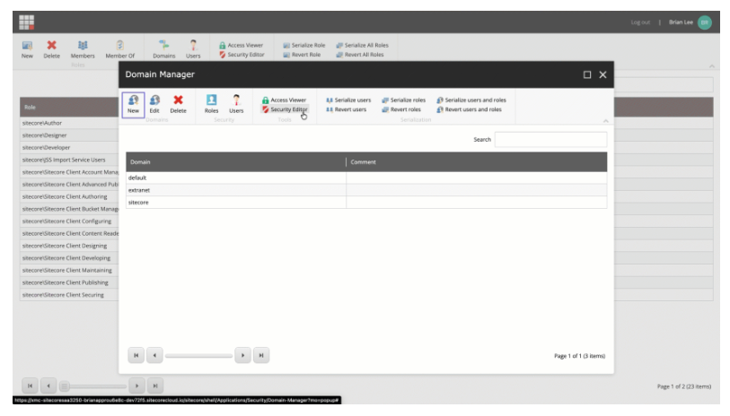

# Sitcore CMS Security

## Source

From: [Website](https://learning.sitecore.com/partners/learn/learning-plans/119/sitecoreai-cms-for-developers/courses/1599/security-for-developers/lessons/3057:1220/security-for-developers)

## Summary

The SitecoreAI security model enables you to grant or deny access to almost every aspect of a website. To do this, you use security accounts and security domains to control the access that users have to the items and content on their website, as well as the access they have to SitecoreAI functionality.

## Key Ideas

> Security settings in SitecoreAI control authoring and editing access only. They are not published to Edge and do not restrict front-end website permissions.

### Users

A user account in SitecoreAI contains the necessary information for [[2026-02-07-authentication-techniques|authentication]] and [[2026-04-10-authorization|authorization]] within the system. User management in SitecoreAI is handled through the [[2026-04-22-sitecore-cloud-portal-security|Sitecore Cloud Portal]], which provides centralized [[2026-02-07-authentication-techniques|authentication]] and user creation capabilities.

 [[2026-02-07-authentication-techniques|Authentication]], team member access, and initial app access are managed in Sitecore Cloud Portal. Within SitecoreAI, administrators manage roles, role membership, and item-level access rights.

### Roles

A role is a collection of users, or a collection of users and other roles. You can assign access rights to groups of SitecoreAI users by making them a member of a role. This [[2026-04-04-role-based-access-control-rbac|role-based]] approach simplifies permission management by allowing administrators to assign permissions to roles rather than individual users.

### Domains

You can use security domains to manage users' access to different parts of SitecoreAI, for example, if you have multiple websites within a single system. A SitecoreAI domain is a collection of security accounts (users and roles) that you can administer as a unit with common rules and procedures.

- **Domains**
  - Groups security accounts
- **Security accounts**
  - **Users** – individuals
  - **Roles** – collection of users or roles

> SitecoreAI [[2026-02-07-authentication-techniques|authentication]] and user creation is managed by the [[2026-04-22-sitecore-cloud-portal-security|Sitecore Cloud Portal]].

## Tools for managing users, roles and domains

SitecoreAI has different applications in the UI to manage users, roles, and domains. Typically, you create domains during implementation. However, you can create roles throughout the lifetime of the application.

### User Manager

The User Manager works in conjunction with the Sitecore Cloud Portal to provide user account management capabilities within the SitecoreAI environment.

Within the User Manager, you can:

- Enable and disable user accounts.
- Access other integrated security tools.

### Role Manager

You can use the **Role Manager** to create and manage the roles that you want to assign to your security accounts (users and roles).

In the Role Manager, you can:

- Create and delete roles.
- Add or remove users and roles as members of a role.
- Open the other security tools.

### Domain Manager

You can use the Domain Manager to create and manage your domains.

In the Domain Manager, you can:

- Create and delete domains.
- Specify whether the domains are global or locally managed.
- Open other security tools.

## Related

- [[2026-04-22-sitecore-cloud-portal-security]]
