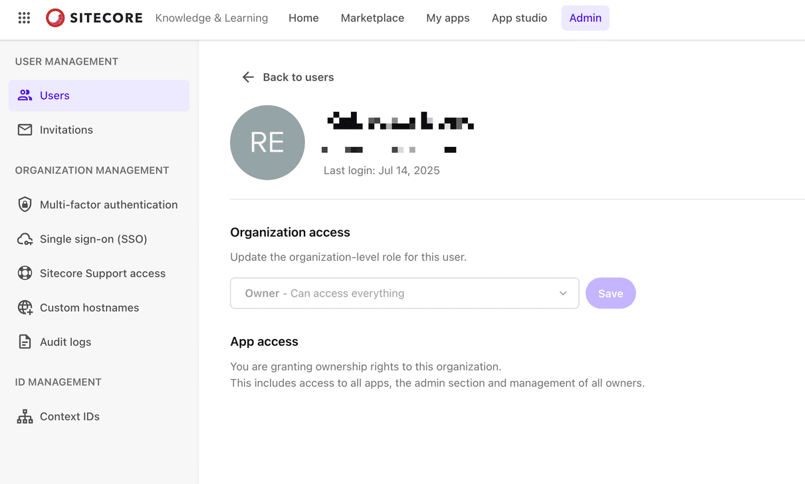
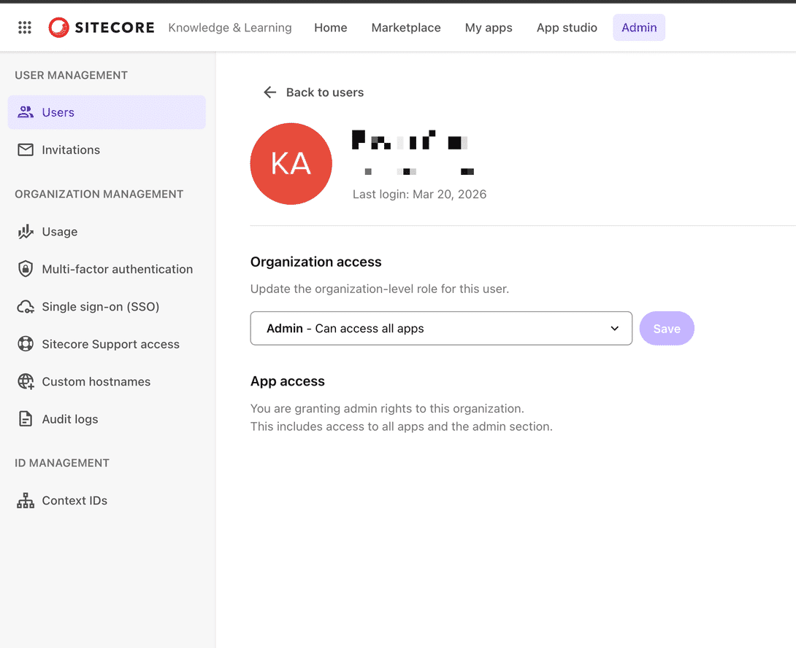
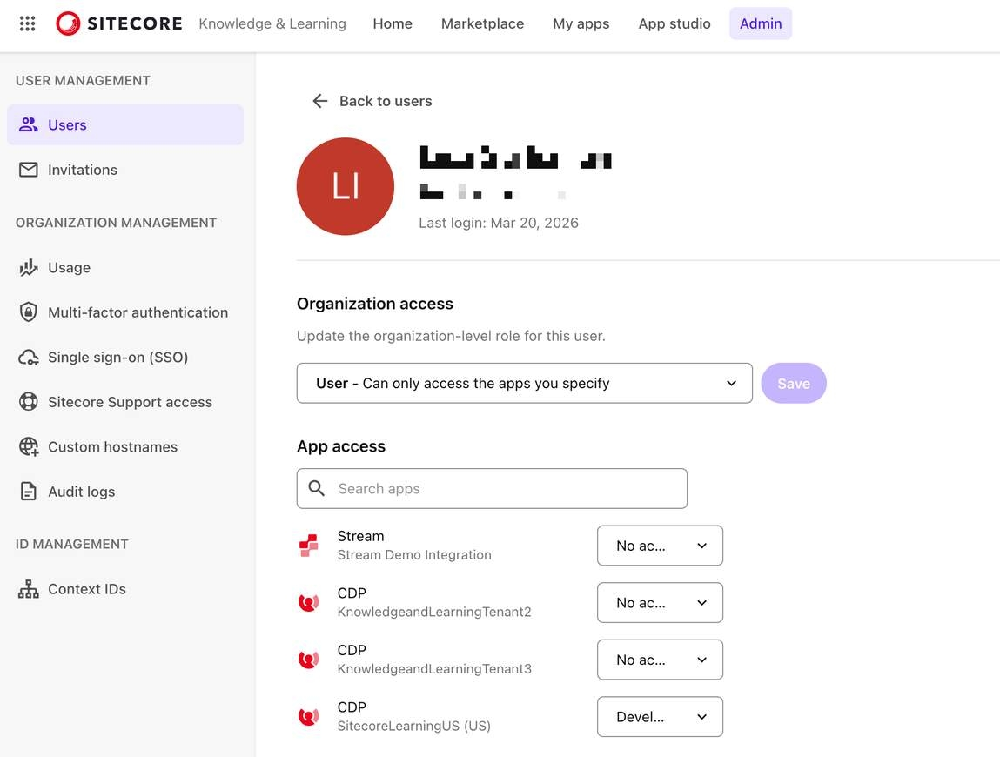

# Sitecore Security

## Source

From: [Website](https://learning.sitecore.com/partners/learn/learning-plans/119/sitecoreai-cms-for-developers/courses/1599/security-for-developers/lessons/3057:1220/security-for-developers)

## Summary

Sitecore Cloud Portal uses an organization-based structure to manage team access and permissions. An organization is the top-level container that houses all team members, applications, and resources for a company or group.

## Key Ideas

### Organization roles and permissions

Sitecore Cloud Portal has three primary organization roles, each with distinct capabilities and responsibilities.

#### Organization Owner

- Highest level of access in the organization.
- Can invite other team members to the organization.
- Can assign any organization role, including other Organization Owners.
- Can manage organization settings and perform all administrative tasks.
- Automatically has the highest role in all apps within the organization.

#### Organization Admin

- Administrative access with most capabilities of an Organization Owner.
- Can invite team members to the organization.
- Can assign Organization Admin and Organization User roles (but cannot create new Organization Owners).
- Can manage team member access and app permissions.
- Automatically has the highest role in all apps within the organization.

#### Organization User

- Standard user access with no administrative capabilities.
- Cannot invite other team members.
- Cannot modify organization settings or manage other users.
- Access is limited to specific apps and roles assigned by administrators.
- Must be granted explicit app access and roles.

### App roles and application-specific permissions

While organization roles determine administrative capabilities, app roles control what team members can do within specific Sitecore applications.

#### Organization roles

Organization roles define administrative capabilities.  

#### App roles

App roles control what team members can do within specific Sitecore applications.  

#### Default access

New Organization Users have no application access until assigned relevant App Roles.  

#### Admin and Owner access

Organization Admins and Organization Owners automatically receive the highest level of access across applications.  

> An Organization Admin inherently has the “Admin” role across all SitecoreAI applications.

### Roles within different apps

- Each Sitecore product can have different roles.
- Depending on the app role assigned, a team member might have limited or no access to certain features within an app.
- Team members are assigned app roles when invited to join the organization.
- App roles can be modified after invitation by Organization Admins or Owners.

> Only Organization Admins or Organization Owners in the Sitecore Cloud Portal organization can use SitecoreAI Deploy app. They are also responsible for granting team members access to the app by changing their roles.

## Related

-
