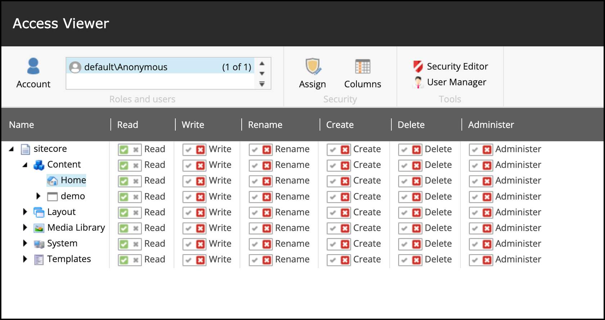
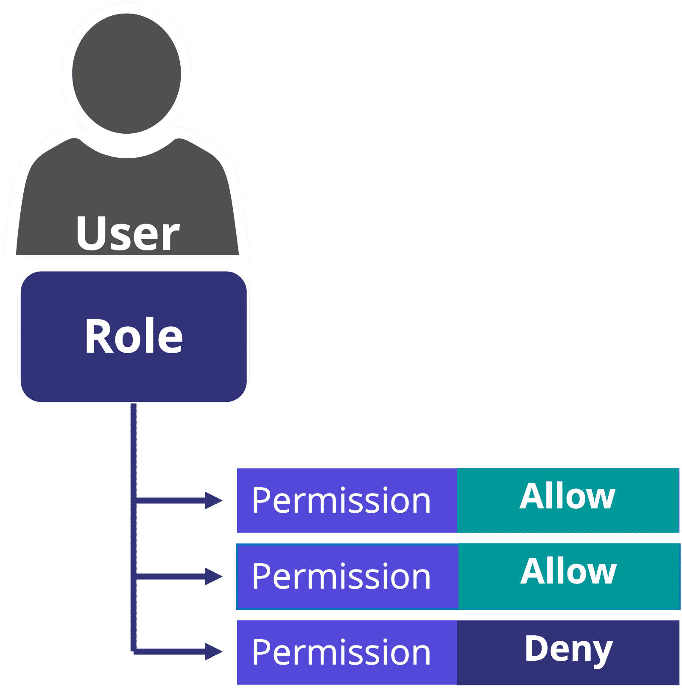
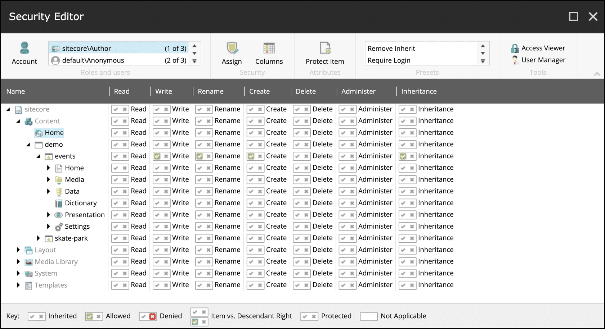
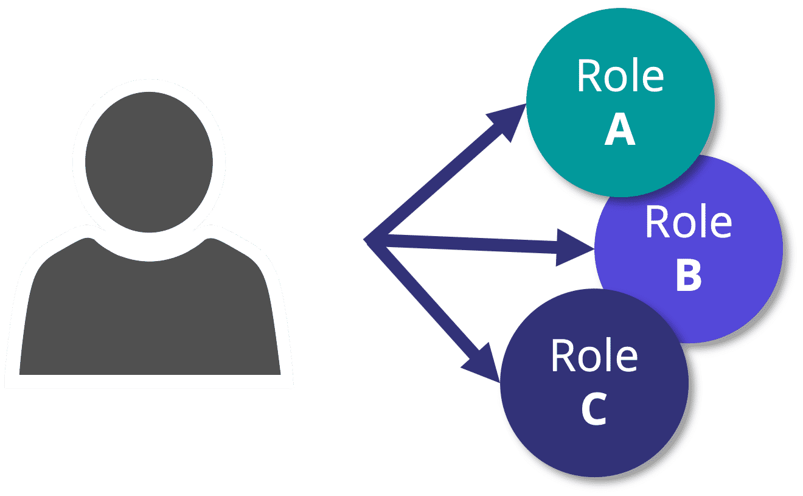
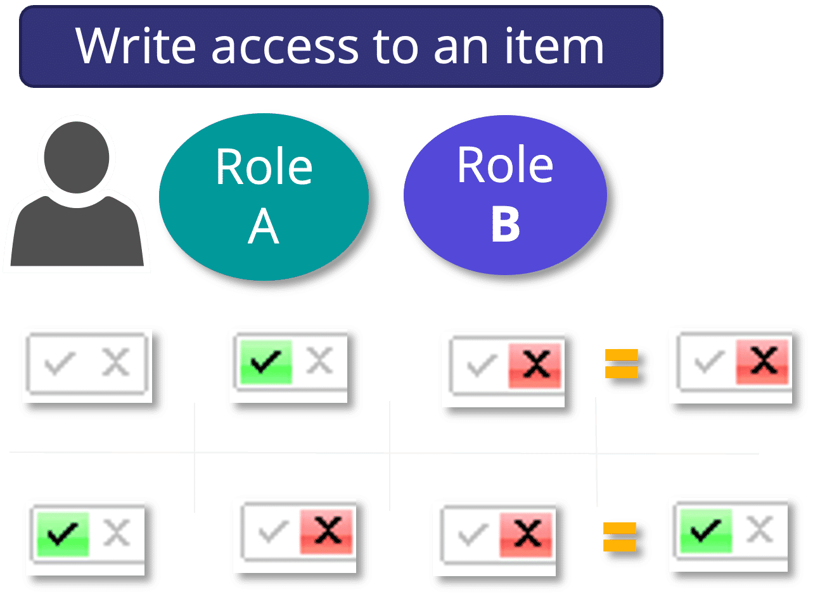

# SitecoreAI permissions

## Source

From: [Website](https://learning.sitecore.com/partners/learn/learning-plans/119/sitecoreai-cms-for-developers/courses/1599/security-for-developers/lessons/3057:1220/security-for-developers)

## Summary

🔐 Access rights in SitecoreAI determine what specific actions a user or role can perform on content items and system functionality. Each access right can have one of three settings:

- 1 **Allow** - Explicitly grants the access right to the selected account.
- 2 **Deny** - Explicitly denies the access right to the selected account.
- 3 **Inherit** - Neither grants nor denies the right; instead, the setting is inherited from the parent item.

## Key Ideas

### Common access rights

- **Read** - View content and items
- **Write** - Modify existing content
- **Rename** - Change item names
- **Create** - Add new content items
- **Delete** - Remove content items
- **Administer** - Full administrative access

  

## Assigning access rights to security accounts

Access rights are assigned on a per-item basis within SitecoreAI. This granular approach allows administrators to control what users and roles can view or do on specific content items in the authoring environment

**Assign access rights to roles vs users**

- Access rights can be assigned to both users and roles.
- Assigning access rights to roles instead of individual users simplifies maintenance.
- Access rights can be assigned and revoked by managing role memberships.
- This approach avoids the need to manage access rights for each individual user account.

Security Editor can:

- Assign access rights to your security accounts (users and roles).
- Protect and unprotect items.
- Open the Access Viewer and the User Manager.

> Note: In the Security Editor, changes are applied immediately, as there are no Undo or Save buttons.

## Inheritance access right system

One of the most powerful features of SitecoreAI security is the inheritance system. Items automatically inherit access rights from their parent items, creating an efficient hierarchical security model.

### Role inheritance

- Access rights are cumulative
- User inherits all rights from assigned roles

### Conflicting access rights

- The same access right may be allowed by some roles the user belongs to and denied by others.
- Rules for access rights resolutions:
  - Explicit deny takes precedence.
  - Role access rights overridden at user level.
  

## Viewing and verifying the access rights

SitecoreAI provides the **Access Viewer** to view and audit the access rights assigned to security accounts. Use the Security Editor to assign and modify access rights. Use the Access Viewer to review the effective permissions that result from inheritance, role membership, and direct assignments.

The **Access Viewer** is similar to the **Security Editor**, but instead of allowing you to modify the access rights, it shows you the most effective setting, allowed or denied.

## Related

-
