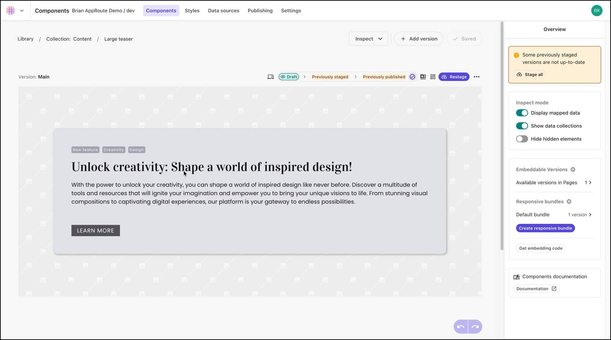
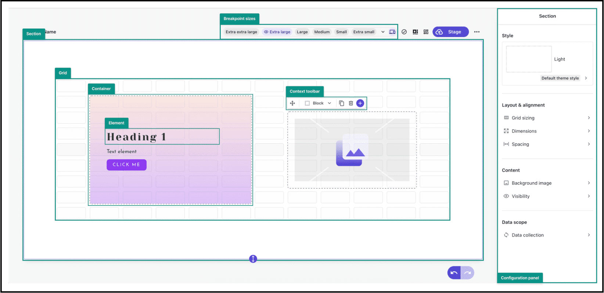

# Components Builder

## Source

From: [Website](https://learning.sitecore.com/partners/learn/learning-plans/119/sitecoreai-cms-for-developers/courses/1595/renderings-and-layouts/lessons/3048:1216/renderings-and-layouts)

## Summary

It's a Front End as a Service (FEaaS) application that allows UI/UX designers or marketers to create their brand’s style guide and build visual components in a What You See Is What You Get (WYSIWYG) editor.

## Key Ideas

### Component builder

A visual tool for creating and managing SitecoreAI Components

Key features:

- Designed specifically for non-developers.
- Enables no-code or low-code component development.
- Supports the integration of dynamic content.
- Includes built-in responsiveness for various devices.
- Offers a real-time preview of changes.

### Components builder interface

The main screen is divided into three key sections:

- **Canvas** - where you’ll assemble your component.
- **Element Library**- which contains all the building blocks you’ll need.
- **Configuration Panel** - where you’ll configure each element’s settings.

## Choosing the right tool

Choosing between using Component builder or Headless [[2026-04-11-sxa|SXA]] components is a critical architectural decision that impacts development speed, flexibility, and long-term maintenance. Understanding the strengths and limitations of each approach enables informed decision-making for optimal project outcomes.

### Key comparison areas

| **Aspect**                 | **Component builder**                        | **Headless SXA Component**                               |
| -------------------------- | -------------------------------------------- | -------------------------------------------------------- |
| **Learning curve**         | Low - Visual interface                       | High - Requires coding skills                            |
| **Development speed**      | Fast - Drag-and-drop assembly                | Moderate - Manual coding                                 |
| **Customization level**    | Limited by available options                 | Unlimited - Full code control                            |
| **Team requirements**      | Mixed teams (designers/marketers/developers) | Primarily developers                                     |
| **Maintenance**            | Simplified updates via UI                    | Code-based maintenance                                   |
| **Performance**            | Optimized generated code                     | Depends on implementation                                |
| **Integration complexity** | Built-in SitecoreAI CMS integration          | Manual integration setup (unless using Clone renderings) |
| **Scalability**            | Good for standard components                 | Excellent for complex scenarios                          |
| **Field editing**          | No field editing at the moment               | Editable fields with field helpers                       |

### In essence

Component builder is the "fast track" for components, while SXA Headless is the "custom route" for specialized needs. The choice depends on your project timeline, team skills, and customization requirements.

## Related

- [[2026-04-22-sitecore-renderings-components]]
