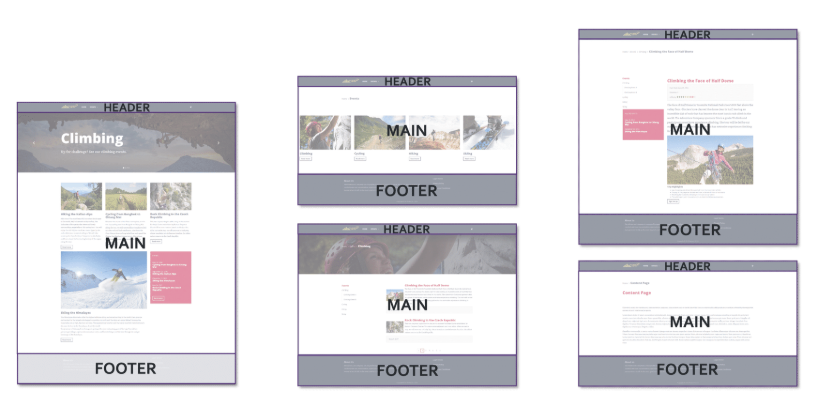

# Sitecore Layouts

## Source

From: [Website](https://learning.sitecore.com/partners/learn/learning-plans/119/sitecoreai-cms-for-developers/courses/1595/renderings-and-layouts/lessons/3048:1216/renderings-and-layouts)

## Summary

Layouts in SitecoreAI CMS establish the structural framework that organizes components within pages. They:

- Define the overall structure of pages with designated areas for components
- Establish grids and content zones where components can be placed
- Control responsive behavior across different breakpoints and devices
- Maintain visual hierarchy to guide users through the intended journey
- Ensure brand consistency while allowing for page-specific variations

## Key Ideas

Key layout considerations include:

- Header and footer frameworks that remain consistent across the site
- Main content areas with flexible column arrangements
- Sidebar regions for supplementary information or navigation
- Responsive breakpoints for mobile, tablet, and desktop experiences
- Specialized templates for different content types (product pages, articles, landing pages)

## Related

- [[2026-04-22-sitecore-presentation-layer]]
- [[2026-04-22-sitecore-placeholders]]
- [[2026-04-28-sitecore-layout-service]]
