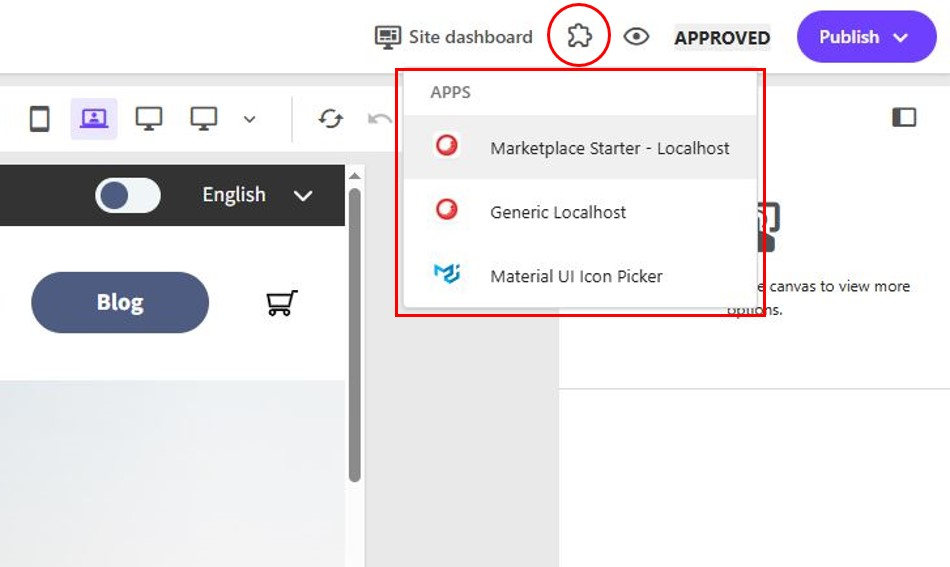
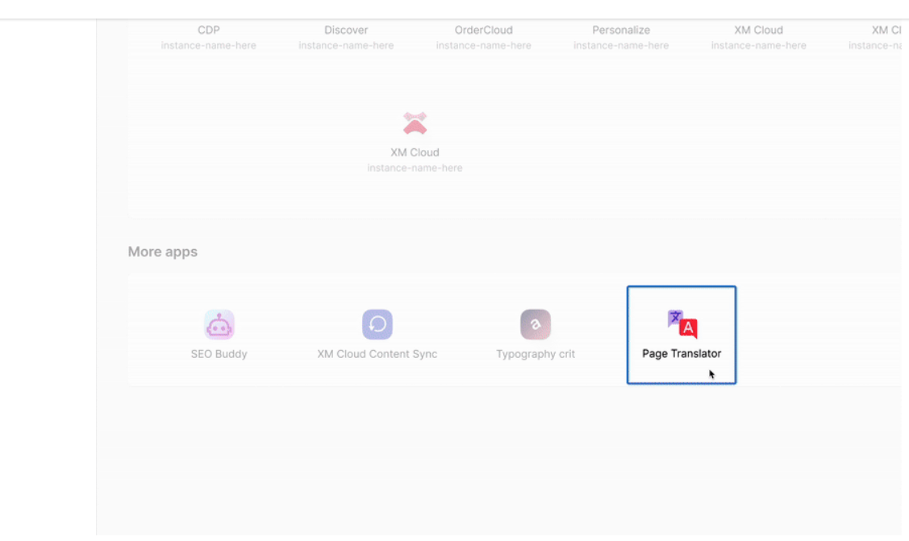
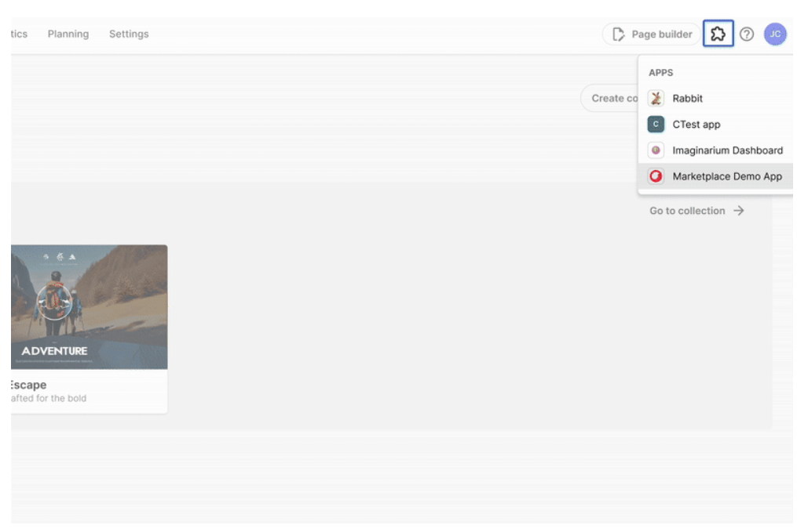
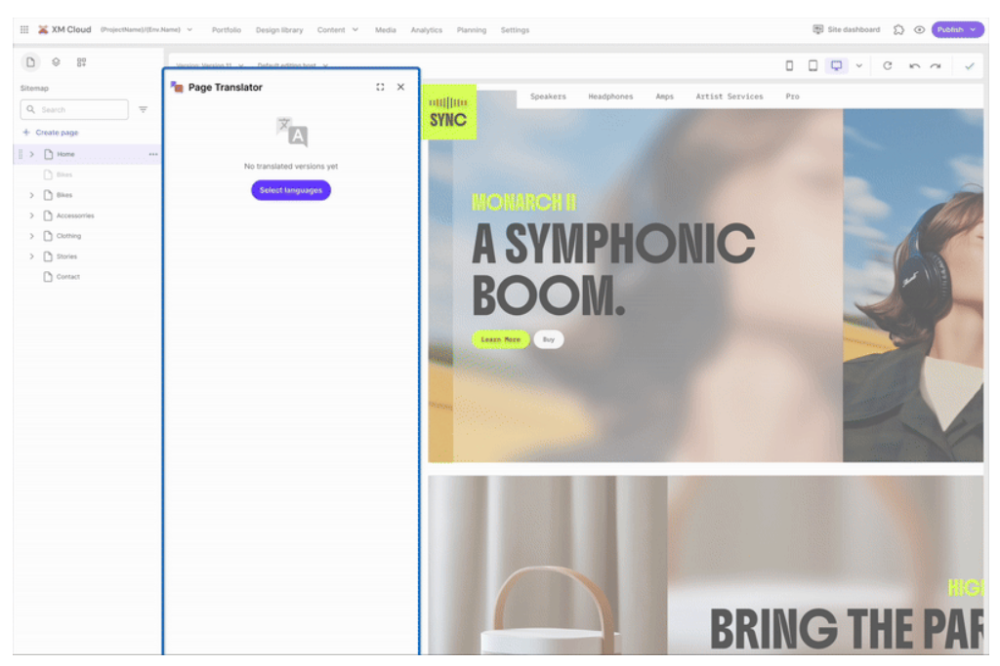
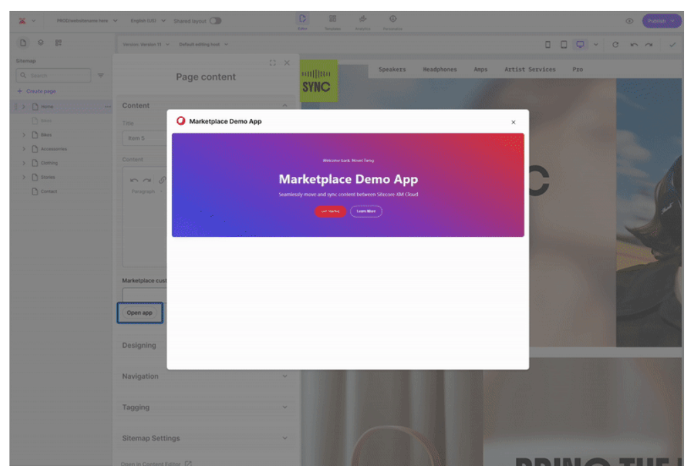
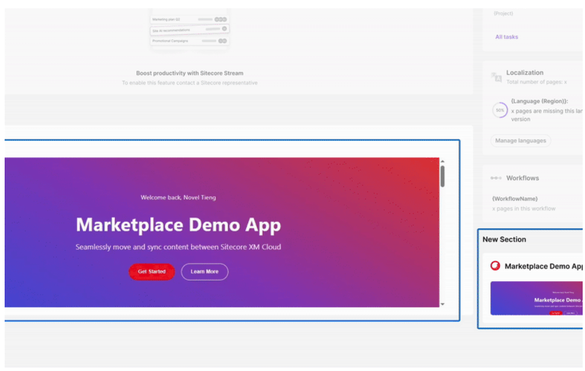

# Marketplace Custom Apps

## Source

From: [Website](https://developers.sitecore.com/learn/getting-started/marketplace)

## Summary

Marketplace Custom Apps are modular, plug-and-play solutions built using Sitecore’s Marketplace SDKs and APIs. They’re designed to integrate into Sitecore environments enriching dashboards, pages, and workflows with tailored functionality. From shoppable images powered by AI to dashboard widgets that surface Google Analytics data, these apps unlock new possibilities for personalization, automation and extensibility.

## Key Ideas - Extension Points

### 1. Standalone - Cloud Portal Homepage

Your app can be launched directly from the Cloud Portal homepage, opening in a new tab. This can be used for general information like health checks, environment overarching information or activities like information transfers.

### 2. Full Screen – XMC – Portfolio (Sites)

Triggered from the top bar navigation in XM Cloud Portfolio (Sites), this extension point is ideal for apps that deal with that particular environment context. These integrations might cover cross-site analytics and data analysis, or centralized redirect and workflow management spanning multiple sites.

### 3. Pages Context Panel – XMC Page Builder

Apps registered for the page context panel appear in a left-side panel within the Page Builder, perfect for page-contextual tools like translation, page related analytics or SEO helpers.

### 4. Custom Field – XMC Page Builder

Enhance content templates (content models) with custom field types e.g. icon pickers, data sources, or input options. In XM Cloud Page Builder those can appear with the page related content on the left panel or within a component context on the right side. This is ideal for personalization and content enrichment.

Adding a custom field requires also adding a field to the data template (content model) of type "Marketplace Types -&gt; Plugin". Read more: [https://doc.sitecore.com/mp/en/developers/marketplace/enable-a-custom-field-in-the-xm-cloud-page-builder.html](https://doc.sitecore.com/mp/en/developers/marketplace/enable-a-custom-field-in-the-xm-cloud-page-builder.html)

### 5. Dashboard Widgets – XMC Dashboard

Add widgets to the dashboard in XM Cloud, such as Google Analytics or SEO data integrations, turning it into a central hub for insights. This extension point is ideal for displaying site-wide performance metrics e.g. from a third-party analytics provider. For example, a chart for visualizing bounce rates, channels, a list of popular pages, and more.

## Marketplace SDK

### [Client package](https://developers.sitecore.com/learn/getting-started/marketplace#client-package)

When building a Marketplace app, one of the first things you’d install (pre-installed in starter kit) is the Marketplace SDK Client package. This isn’t just a utility—it’s the backbone of how your app securely communicates with Sitecore.

#### [What it does](https://developers.sitecore.com/learn/getting-started/marketplace#what-it-does)

The Client Package enables secure, bidirectional communication between your Marketplace app (the client) and Sitecore (the host). Your app runs inside a sandboxed iframe, and thanks to the browser’s postMessage API, it can safely exchange data with Sitecore—without compromising security or performance.

This package empowers your app to:

- Make Queries: Retrieve one-off data or subscribe to live updates. You can access the host’s state, environment, and app context.
- Make Mutations: Trigger state changes or perform HTTP requests directly in Sitecore.
- Interact with Sitecore APIs: Execute actions based on the resource access granted during installation.

Inspired by GraphQL and React Query, the SDK’s query/mutation API handles internal state, loading indicators, and error management—so you can focus on building, not boilerplate.

#### [Why it matters](https://developers.sitecore.com/learn/getting-started/marketplace#why-it-matters)

This package is what makes your app feel native. It’s how your app knows where it’s running, who’s using it, and what it should do next.

[Read more about the Client package](https://www.npmjs.com/package/@sitecore-marketplace-sdk/client)

### [XMC package](https://developers.sitecore.com/learn/getting-started/marketplace#xmc-package)

Once your Marketplace app is wired up with the Client package, the next step is unlocking the full power of XM Cloud. That’s where the XMC package of the Marketplace SDK comes in.

This package extends the Client SDK and gives your app type-safe access to key Sitecore APIs, so you can build smarter, faster, and with confidence.

#### [What it does](https://developers.sitecore.com/learn/getting-started/marketplace#what-it-does-1)

The XMC package connects your app to the following - [[2026-04-20-sitecore-apis|Sitecore APIs]]

#### [Why it matters](https://developers.sitecore.com/learn/getting-started/marketplace#why-it-matters-1)

The XMC package turns your app into a true XM Cloud citizen—capable of reading, writing, and orchestrating content and configuration across the platform.

[Read more about the XMC package:](https://www.npmjs.com/package/@sitecore-marketplace-sdk/xmc)

## [Accelerate Development with the Marketplace Starter Kit](https://developers.sitecore.com/learn/getting-started/marketplace#accelerate-development-with-the-marketplace-starter-kit)

To help developers hit the ground running, Sitecore offers a Marketplace Starter Kit Repository. A ready-to-clone Next.js template that includes everything you need to start building a Marketplace app. It’s pre-configured with the Marketplace SDK, supports React and Next.js, and provides sample implementations for each extension point. Whether you're targeting Pages, Dashboards, or the Cloud Portal homepage, the Starter Kit simplifies setup, enforces best practices, and ensures your app feels native from day one.

[Check out the Marketplace SDK](https://github.com/Sitecore/marketplace-starter)

## Conclusion: [Why Marketplace Custom Apps Matter](https://developers.sitecore.com/learn/getting-started/marketplace#conclusion-why-marketplace-custom-apps-matter)

Marketplace Custom Apps are more than just extensions. They’re enablers of agility, innovation at the fingertips of marketers. **For developers**, they offer a secure, scalable way to build modular solutions without touching the core. **For organizations**, they unlock tailored functionality that fits seamlessly into Sitecore’s composable architecture. And **for marketers and authors**, they deliver intuitive tools that enhance productivity and accelerate execution. With the Marketplace, Sitecore becomes not just a platform—but a launchpad for what’s next.

## Related

- [[2026-04-20-sitecore-apis]]
- [Quick Start](https://doc.sitecore.com/mp/en/developers/sdk/0/sitecore-marketplace-sdk/quick-starts.html)
- [Marketplace Starter Kit](https://github.com/Sitecore/marketplace-starter)
- [Overview of Extension Points](https://doc.sitecore.com/mp/en/developers/marketplace/extension-points.html)
- [Documentation](https://doc.sitecore.com/mp/en/developers/marketplace/introduction-to-sitecore-marketplace.html)
