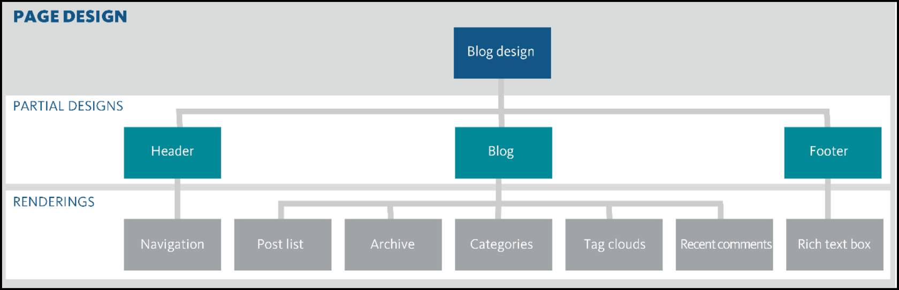
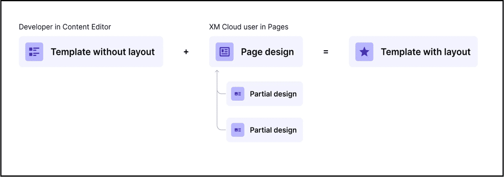

# Sitecore Page Designs and Partial Designs

## Source

From: [Website](https://learning.sitecore.com/partners/learn/learning-plans/119/sitecoreai-cms-for-developers/courses/1595/renderings-and-layouts/lessons/3048:1216/renderings-and-layouts)

## Summary

## What is Page Designs and Partial Designs

- **Page designs** - A Page Design combines selected partial designs to create structured page layouts.
- **Partial Designs** - A partial design is simply a logical grouping of components.

## Key Ideas

### Page Design

A selection of partial designs that make up the structure of a page; consists of a selection of partial designs. You can, for example, make sure the headers and footers are always in the same place. You can also create a page design to set up a page structure for specific pages, such as a blog page, a landing page, or a product page.

### Partial designs

 Sets of renderings that make up a webpage. Use partial designs to create the design elements of your pages quickly and with a consistent style. For example, parts of a page—such as headers and footers—can be created once and then used everywhere on your site. Partial designs can inherit from each other, so you can build increasingly complex designs from a basic set of reusable partial designs.

### Implementation process

Use **Page builder** Templates mode to:

1. Create partial designs
2. Create page designs
3. Assign the page designs to templates

## Related

- [[2026-04-11-sxa|SXA]]
