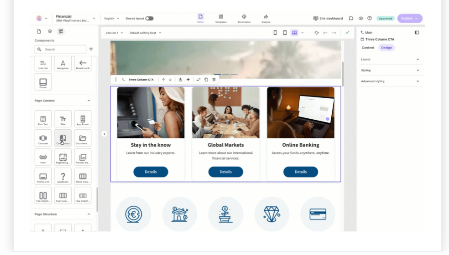

# Sitecore Renderings (Components)

## Source

From: [Website](https://learning.sitecore.com/partners/learn/learning-plans/119/sitecoreai-cms-for-developers/courses/1595/renderings-and-layouts/lessons/3048:1216/renderings-and-layouts)

## Summary

Components in SitecoreAI serve as specialized containers that visualize content in meaningful ways. They are:

- **Modular content blocks** that transform data into visually appealing, interactive elements.
- **Reusable across multiple pages** to ensure consistency and streamline development.
- **Highly configurable** with customizable parameters and styles to match brand requirements.
- **Dynamic and responsive** to adapt seamlessly across devices and screen sizes.

## Key Ideas

In SitecoreAI, components can be categorized as:

- **Content Components**: Display content from SitecoreAI (e.g., articles, product details).
- **Navigation Components**: Help users navigate the site (e.g., menus, breadcrumbs).
- **Interactive Components**: Enable user interactions (e.g., forms, search boxes).
- **Layout Components**: Structure the page (e.g., columns, rows and containers).
- **Composite Components**: Contain other components (e.g., carousels, tab).

Examples of components include:

- Hero banners with customizable backgrounds, CTAs, and messaging.
- Product showcases with filtering options and interactive galleries.
- Content carousels that automatically rotate through featured items.
- Personalized recommendation blocks based on user behavior and preferences.
- Interactive forms with validation and submission capabilities.

## Approaches to component development

There are three primary ways to create components for SitecoreAI:

- **Code-based components** using JavaScript front-end framework and Sitecore JavaScript based SDK.
- **No-code/low-code components** using the SitecoreAI **Components** **builder.**
- **Bring Your Own Components (BYOC)** by integrating existing external components.

## Related

- [[2026-04-22-sitecore-presentation-layer]]
- [[2026-04-22-sitecore-rendering-parameters-template]]
- [[2026-04-22-datasources-in-component]]
- [[2026-04-22-sitecore-placeholders]]
