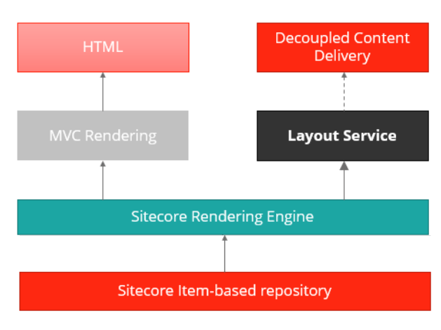
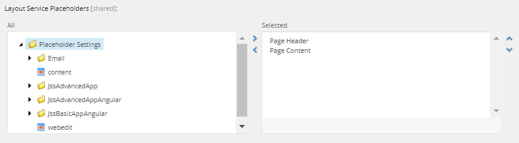

# Sitecore Layout Service

## Source

From: [Website](https://doc.sitecore.com/xp/en/developers/hd/22/sitecore-headless-development/layout-service.html)

## Summary

The Sitecore Layout Service is a Sitecore Headless Services endpoint that exposes Sitecore layout information as structured JavaScript Object Notation (JSON) data.

The service leverages the [Sitecore Rendering Engine](https://doc.sitecore.com/xp/en/developers/hd/22/sitecore-headless-development/rendering-engines.html) to produce structured JSON output, decoupling *layout* and *rendering*, and allowing you to render Sitecore components with any front-end technology stack capable of consuming JSON data.


## Key Ideas

## Related

## Layout Service actions

The Layout Service exposes two actions:

- Getting the output of the whole layout for the item.
- Getting the output of a particular placeholder.

To resolve to the desired Site Context, invoke the layout service using the `sc_site` query string parameter or using a hostname because Layout Service paths are relative to the Home item of the site.

### Getting the output of the whole layout for the item

To get the full layout output for an item, you must invoke the `render` endpoint of the Layout Service:

```url
/sitecore/api/layout/render/[config]?item=[path]&sc_lang=[language]&sc_apikey=[key]&tracking=[true|false]&sc_site=[your-site-name]
```

The available parameters are:

| Parameter | Description |
| --- | --- |
| `config` | The name of the Layout Service configuration to use. For JSS, this is usually `jss`. |
| `item` | The path to the item, relative to the context site's home item or item GUID (ID). |
| `version` | The version number of the item. It should be a valid integer value. |
| `sc_lang` | The language version of the item you want to retrieve. |
| `sc_apikey` | An [SSC API Key](https://doc.sitecore.com/xp/en/developers/104/sitecore-experience-manager/api-keys-for-the-odata-item-service.html) for the Layout Service controller (`Sitecore.LayoutService.Mvc.Controllers.LayoutServiceController`, `Sitecore.LayoutService.Mvc`). An API Key is required in the query string or sent through the `sc_apikey` HTTP Header. |
| `sc_site` | The name of the site to fetch data for. Needed for the analytics tracking included in Layout Service calls. |
| `tracking` | (Optional, only with Sitecore XP.) Enables/disables analytics tracking for the Layout Service invocation.<br><br>Default: `true`. |
| `tracking_query` | Optional, only with Sitecore XP. The custom query string value will be saved as a query string in the URL of the `PageView` event in xConnect if tracking is enabled. The value has to be in the format `param1=value1|param2=val2`. |

### Getting the output of a particular placeholder

This action is useful in special circumstances when your app needs to access a portion of the layout, minimizing the amount of data processed and sent over the wire.

```url
/sitecore/api/layout/placeholder/[config]?placeholderName=/main&item=[path]&sc_lang=[language]&sc_apikey=[key]&tracking=[true|false]
```

This action accepts the same parameters as the `/render` action described previously, as well as the following:

| Parameter | Description |
| --- | --- |
| `placeholderName` | The name of the placeholder to render. You can retrieve the value of this parameter from the layout details in the Content Editor. Due to the dynamic placeholders used out of the box for the `jss` configuration, you must use the dynamic placeholder format here. |

> **Caution** Add `tracking=false` when using this action to prevent invocations of the `placeholder` action from corrupting page visit data in xDB.

### Layout Service and Sitecore Placeholders

To return an item's full structured layout data, the Layout Service must know the placeholders on a rendering.

To make these exposed placeholders discoverable, the Layout Service Placeholders field must be populated.



> Warning - Do not confuse this with the Allowed Controls on Placeholder Settings, defining the renderings that can be added to a placeholder. The Layout Service Placeholders field defines the placeholders to use within the frontend rendering host.

- [[2026-04-22-sitecore-layouts]]
