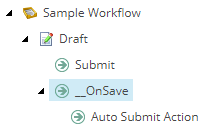

# __OnSave command

## Source

From: [Website](https://doc.sitecore.com/sai/en/developers/sitecoreai/content-modeling-and-presentation/workflow/workflow-reference/defining-workflows.html)

## Summary

The `__OnSave` command is a placeholder for actions that take place when a user saves changes to a content item in this state. The `__OnSave` command's functionality is defined in the `saveUI` pipeline in the `web.config` file.

In the *Sample Workflow*, the `__OnSave` command triggers the Auto Submit Action. When users who are members of the Sitecore Minimal Page Editor role save an item, the Auto Submit Action moves the content item to another state. This is done automatically because members of the Sitecore Minimal Page Editor role do not have access to the workflow related commands in the Page Editor.

## Key Ideas

## Related

- [[2026-04-21-sitecore-workflows]]
