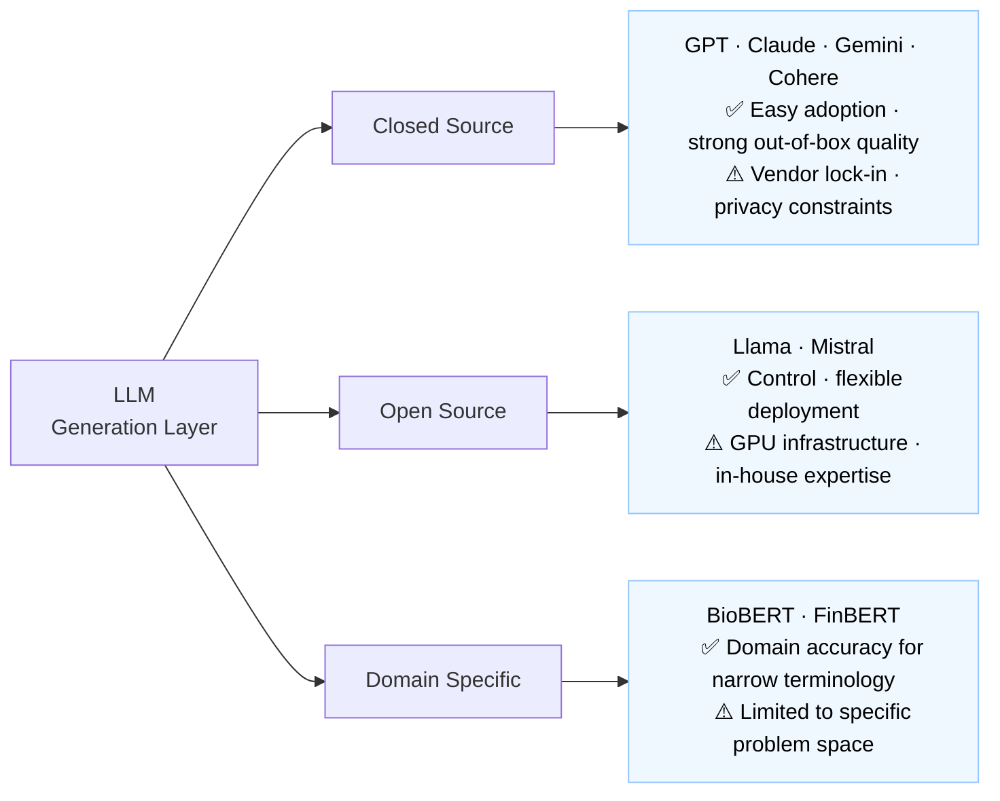
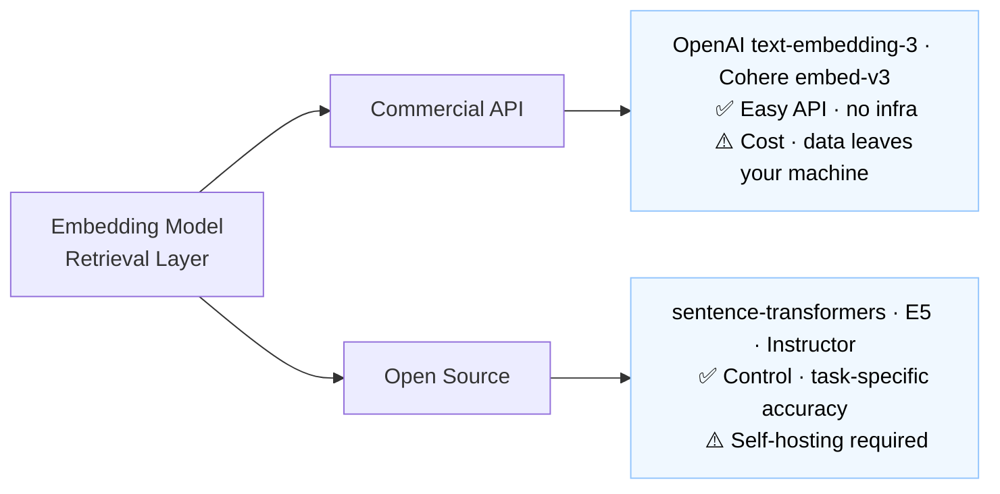
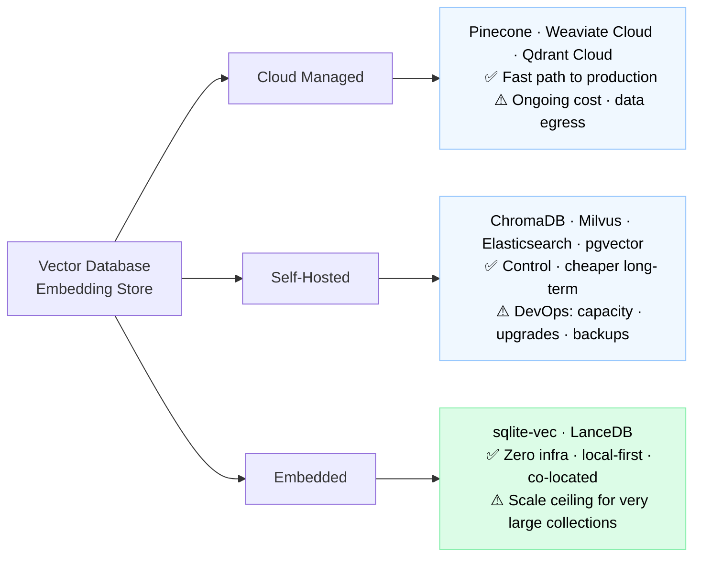
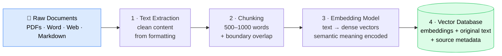
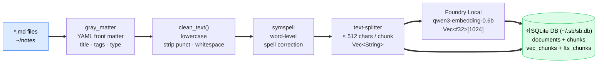
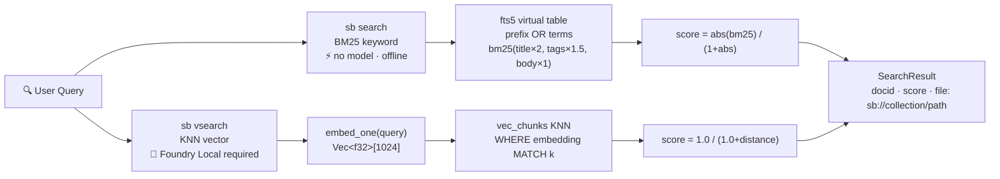
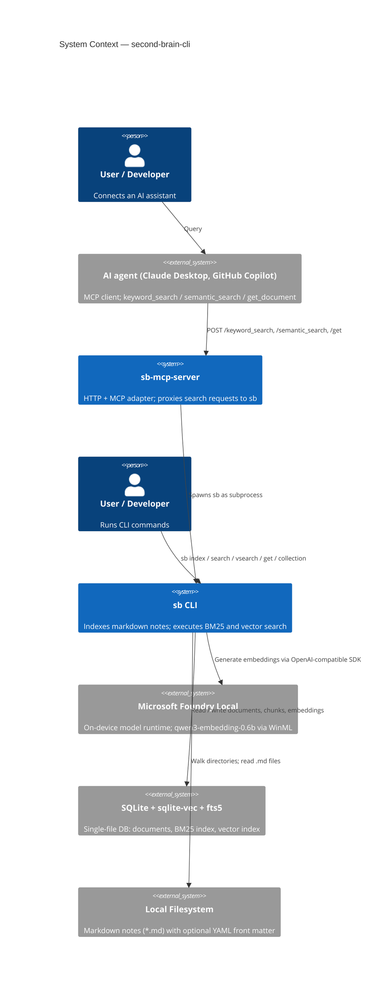
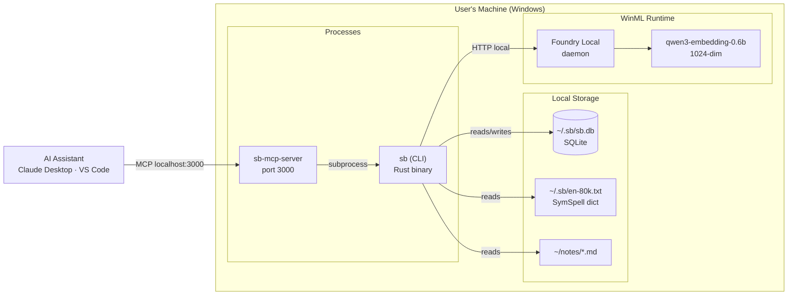
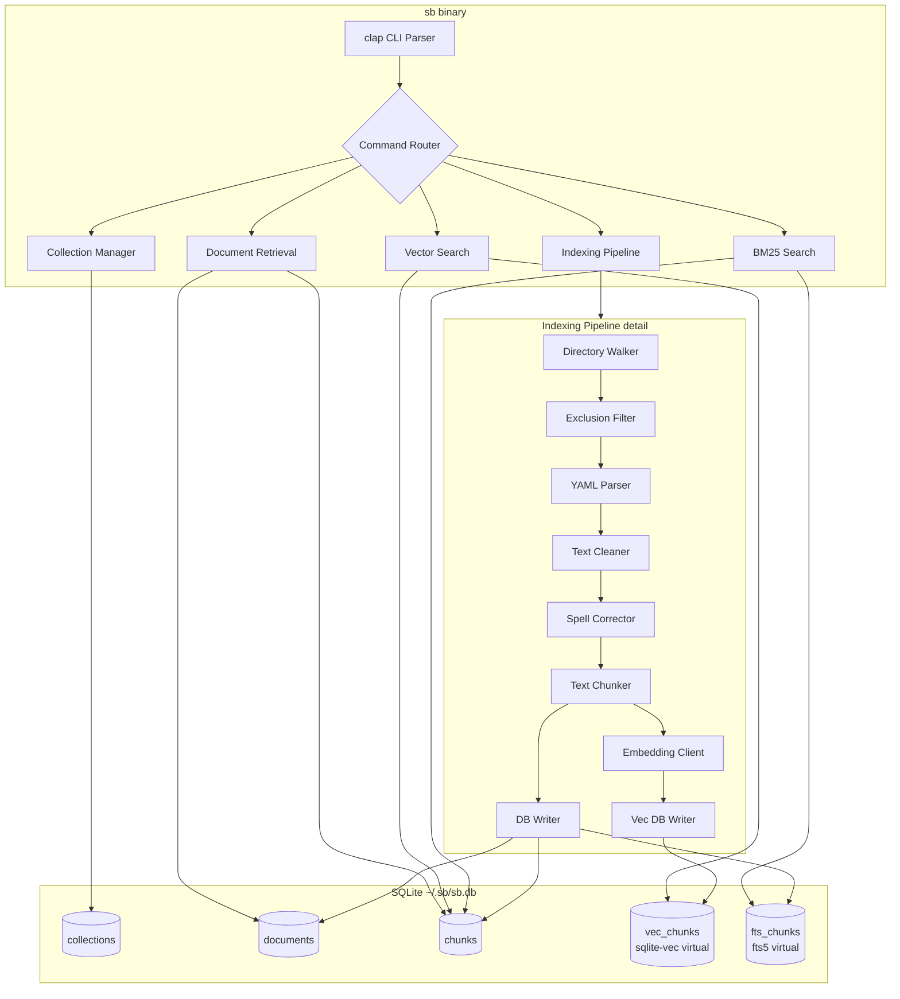
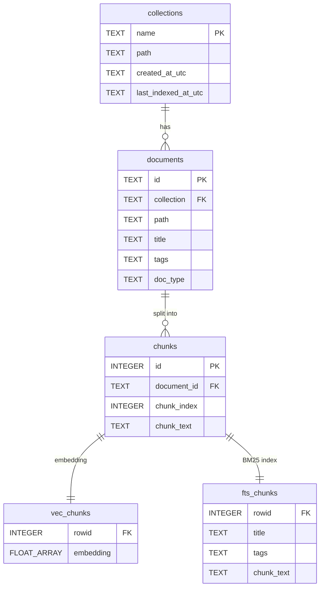

# second-brain-cli — Architecture

> Local-first RAG knowledge retrieval: Rust CLI + SQLite + Foundry Local

---

## RAG Technology Choices

### Choosing an LLM for RAG

---

### Choosing an Embedding Model for RAG

**This workspace:** `qwen3-embedding-0.6b` via Foundry Local — open source, on-device (WinML), 1024-dim, no API key

---

### Choosing a Vector Database for RAG

**This workspace:** `sqlite-vec` embedded in SQLite — driven by: local-first constraint, low data volume, zero DevOps

---

## RAG Lifecycle

### Document Preparation Phase (Offline)

**This workspace pipeline:**

---

### Query Processing Phase (Real-time)

**This workspace — two query modes:**

---

## System Architecture

### System Context

### Deployment

### Component Architecture

---

## Database Schema

> `vec_chunks.rowid` and `fts_chunks.rowid` align to `chunks.id` — single integer join key across both indices.

---

## Technology Stack

| Layer            | Technology                             | Note                                       |
| ---------------- | -------------------------------------- | ------------------------------------------ |
| Language         | Rust                                   | Memory safety · native binary · no runtime |
| CLI              | `clap`                                 | Type-safe derive-based arg parsing         |
| Database         | SQLite + `rusqlite`                    | Zero-dependency single file                |
| Full-text search | SQLite fts5                            | BM25 · co-located with vectors             |
| Vector search    | `sqlite-vec`                           | Embedded KNN · no separate process         |
| Embeddings       | Foundry Local + `qwen3-embedding-0.6b` | On-device WinML · 1024-dim · no API key    |
| Chunking         | `text-splitter`                        | ≤ 512 chars per chunk                      |
| Spell correction | `symspell`                             | Symmetric-delete algorithm                 |
| Front matter     | `gray_matter`                          | YAML extraction                            |
| Async            | `tokio`                                | Required by Foundry Local SDK              |
| MCP transport    | Axum + `rmcp` (`sb-mcp-server`)        | HTTP gateway · spawns `sb` subprocess      |

---

## Next Steps

- **Model caching** — keep embedding model loaded in `sb-mcp-server` between requests
- **Dict caching** — keep `SymSpell dict` loaded in `sb-mcp-server` between requests
- **Hybrid re-ranking** — combine BM25 + vector scores (reciprocal rank fusion)
- **Cross-platform** — abstract Foundry Local behind a provider trait (Linux/macOS via llama.cpp or ONNX)
